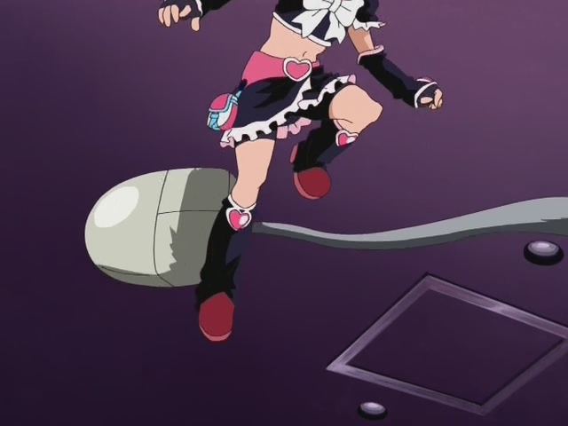

Futari wa Precure (27) 28-49 END
=================================

   
 2011-10-01, 15:17   
   [<<](Futari%20wa%20Precure%2001-26%20+%2027)    
 Досмотрел. Как и в  [1-й арке](Futari%20wa%20Precure%2001-26%20+%2027)  накал к концу возрастает. Серии в районе 35-40, наоборот, показались "провисшими".   
   
 Продолжим циничные комментарии. Хотя и не такие они циничные.   
   
 Что забыл сказать по первой арке:   
 -- Родители Хоноки странные типчики, гордятся тем, что хотя бы раз в год приезжают с дочкой увидеться. Уж не знаю, действительно ли у них такая серьёзная работа, и можно ли гордиться тем, что они могут приехать  *хотя бы раз в год*  .   
 -- То, что все разрушения после визита злодеев исчезают, а также то, что их никто из простых смертных никак не может раскрыть главных героев (то нет никого, то сознание теряют, то всё видели, но    *не узнали*    , говорит о возможности странной групповой паранойи, когда они думают, что они девочки-волшебницы, однако на самом деле таковыми не являются.   
 -- Зам. директор не злой, он просто предан своей работе... может быть у него синдром гардеробщика, хотя у него довольно высокая должность. Короче, он хочет, как лучше, хотя он не умён.   
   
 По новомой арке:   
 -- В серии про свадьбу сенсея было сказано, что муж этой сенсей после свадьбы переводится. Это ужасно.   
 -- Порадовала тема про лоскутное одеяло и подушку, там сказали, что это американское изобретение или что-то в этом роде. У нас на даче есть лоскутные одеяла, да.   
 -- 42-я серия замечательная, авввв Нагиса...   
 -- Да, Кирию просто-так потерять не могли... интересно, сможет ли он вернуться полностью, аввв Хонока.   
 -- Музыкальная тема особняка новых злодеев очень хорошая.   
 -- Ололо, хор поёт эндинг от сериала!   
 -- Да, эндинг шикарный и был, а когда его поют персонажи, ещё лучше. а когда ещё и битва разворачивается на фоне спокойного хорового пения, ещё лучше.   
 -- На фоне предыдущего комментария я подумал, что можно было бы сделать хэнсин ГГ-ев по музыку  [Running in the 90's](https://www.youtube.com/watch?v=XCiDuy4mrWU)  , может сделаю когда-нибудь.   
 -- Начальницу хора зовут Тиаки, лол. А ещё она перфекционистка, ня. Ещё и в очках. Дабл-ня.   
 -- Злодеи 2-й арки имеют свой хэнсин, хоть и очень короткий   
 -- Злодеи 2-й арки мне понравились гораздо больше, чем злодеи первой. У них есть свои мысли и действия и выглядят они лучше.   
 -- К концу я вообще за этих злодеев болел и переживал, правда потом оказалось, что за них болеть не следовало, т.к. исход-то один.   
 -- DUAL AURORA WAVE!   
 -- Главные герои типичные Марисы -- они подчиняются принципу Марисы: "Неважно! Мы просто будем бить плохих парней, пока проблема не будет решена!".   
  [Картинки (возможны спойлеры; возможны картинки из 1-й арки)](https://zHz00.diary.ru/p167417203.htm?index=1#linkmore167417203m1)       
 Да, если говорить в вентилятор, звук будет именно таким, каким это обычно показывают в аниме. Варэ-варэ ва утю:дзин.   
    
 Нет, это не Босоногий Гэн и не Могила Светлячков.   
    
 Я подумал то же, что подумал бы, увидев, как кто-то играет атомными бомбами.   
    
 ХАРУХИ?! Кстати, это одна из злодеек.   
    
 ОРЭ ДА. ЭЛ ПСАЙ КОНГУРУ!   
    
 Вот они, няшечки, после хэнсина. С третьим картинки не нашёл, но он тоже хороший.   
    
 Рояль в кустах.   
    
 "АРЭЭЭЭЭЭЭЭ?" Буду медитировать на эту картинку.   
    
 Где-то я это уже видел...   
    
 ЧТО ОН ДЕЛАЕТ?!   
    
 Башни-близнецы.   
    
 Неравный поединок с мышкой.   
    
 Шок учеников по поводу известия о свадьбе учительницы.   
    
 Что-то старенького она себе выбрала, подумал я.   
    
 А это был не он просто.   
    
 То одеяло+Нагиса поймала букет, да.   
    
 Оружие пролетариата.   
    
 Тот-кого-нельзя-называть воскрес.   
    
 Супер удар попой по лицу!   
    
 "Тьма накрыла ненавидимый прокуратором город..."   
    
      
   
 Сделал ачивки по Прекуре.   
 Качается 2-й сезон.   
    
 <https://diary.ru/~zHz00/p167417203_futari-wa-precure-27-28-49-end.htm>   
   
 Теги:   
 [[Аниме]]   
 ID: p167417203