Futari wa Precure 01-26 + 27
=============================

   
 2011-09-11, 23:33   
   *C\*\*\*: Злобные японцы таки заставили тебя просмотреть бесконечный онгоинг.Т\_\_Т*    
 Увы, да.   
  *Сестра: Ты что, одну и ту же серию по несколько раз смотришь?*    
 Тонкое замечание! Очень тонкое!   
   
 Первая арка досмотрена и начата вторая (27). Далее по тексту могут быть спойлеры, но, в основном, повешено предупреждение.   
 Итак, лучшая сцена:   
       
 Лучший кадр  [показать](https://zHz00.diary.ru/p166686926.htm?index=1#linkmore166686926m1)    (это проектор планетария под действием тёмных сил):  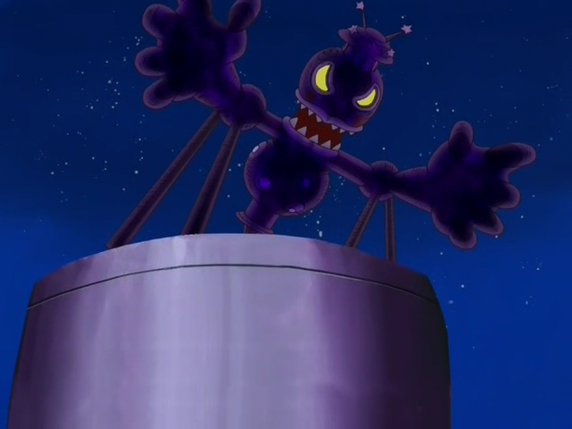      
   
 Циничное мнение:   
 -- Ну, хотелось бы побольше спеллкарт;   
 -- А что они вообще сражаются за чьё-то благо? А зарплата?  *Правильный ответ: потому что 1) больше некому 2) этот мир зависит от того*  ;   
 -- Я предпочитаю сражения в стиле коммандос (как в Сяне или Индексе), а не атаки в лоб;   
 -- Начиная серии с десятой начал переживать за персонажей. До этого было скучновато. А переживать, в смысле, беспокоиться, откуда в этот раз появится бог из машины;   
 -- С 20-й серии началась жесть -- история с Кирия-куном шикарна...   
 -- Первый злодей поразил благородством;   
 -- Злодеи тоже не любят стиль коммандос -- ходят на дело по одному... а Тёмный Лорд вообще отсиживается... мне кажется, он с места двинуться не может; ну и как он поступил с последним злодеем -- это было... не очень хорошо;   
 -- Может быть, из-за просмотра Мадоки, всё время ожидал подлянок со стороны своих... особенно со стороны Мудрости...   
 -- Вообще тут предсказания, которые я придумываю, часто сбываются.   
 -- Бабушка у Хоноки крутая!   
 -- ZAKENA!   
  [Спойлеры-предсказания](https://zHz00.diary.ru/p166686926.htm?index=2#linkmore166686926m2)      
 -- После того, как сказали, что Тёмный Лорд посеял семь семян, я подумал, что, наверное, это крестражи... так и оказалось;   
 -- После того, как показали, что единственная женщина из злодеев может менять облик, я подумал, что она обязетльно должна прикинуться одной из Прекуре. Так и вышло. Спустя десять серий, правда;     
  [Ещё скрины (много, возможны спойлеры)](https://zHz00.diary.ru/p166686926.htm?index=4#linkmore166686926m4)     [ёнкома](https://zHz00.diary.ru/p166686926.htm?index=3#linkmore166686926m3)     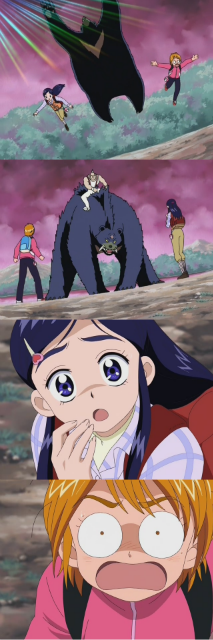      
  Самогонный аппарат:   
 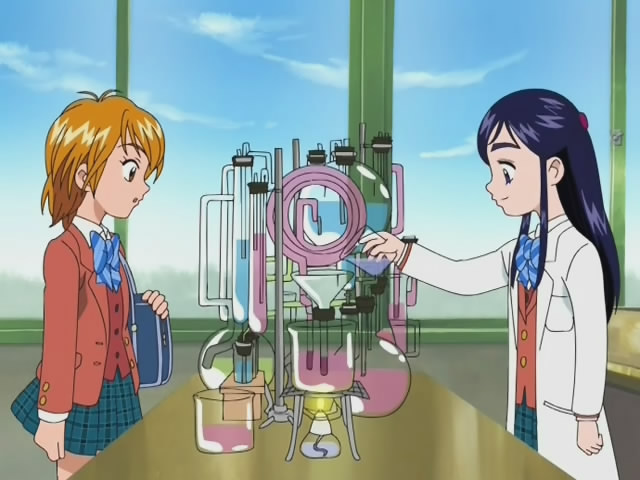   
 Лангольеры (две картинки):   
 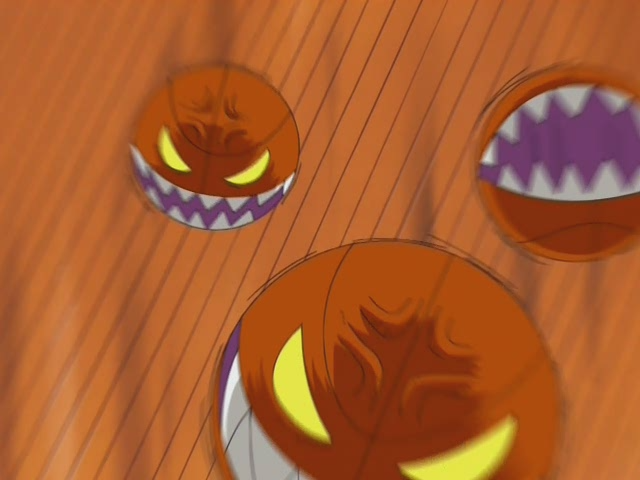   
 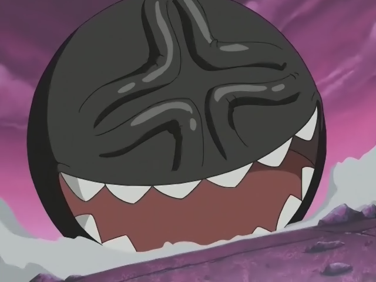   
 Страх:   
 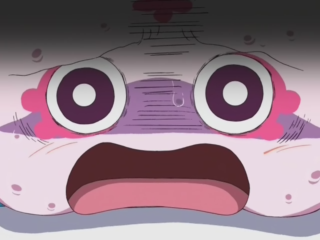   
 Пачули Ноледж (снизу -- арт по Тоохоо, сверху -- персонаж из Прекуре, зовут Мудрость, лол):   
 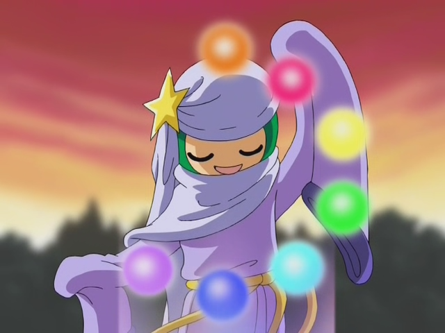   
    
 Хироси, друг Сунако (Семь обличий Ямато Надэсико):   
 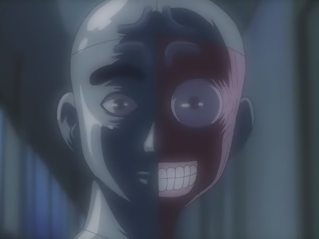   
 Кто-то там без ума от медсестёр?   
 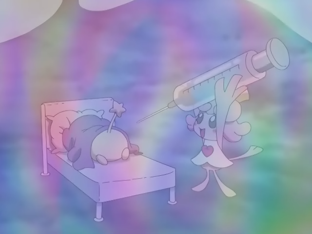   
 Оу...   
 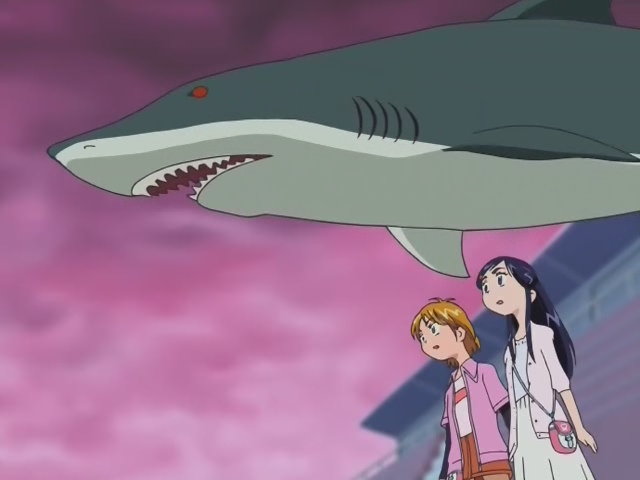   
 БАААААААААААКА!   
 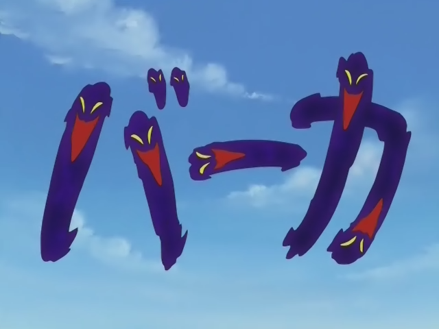   
 THERE ARE ALWAYS POOLS OF BLOOD IN DEEP SHADOWS (Lain):   
 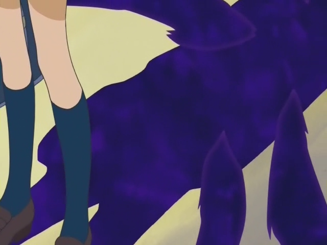   
 Мисаки?..   
 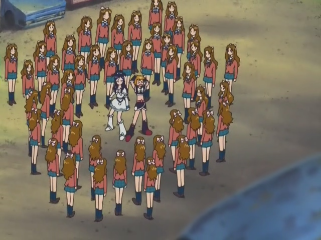   
 Найти и понюхать (С):   
 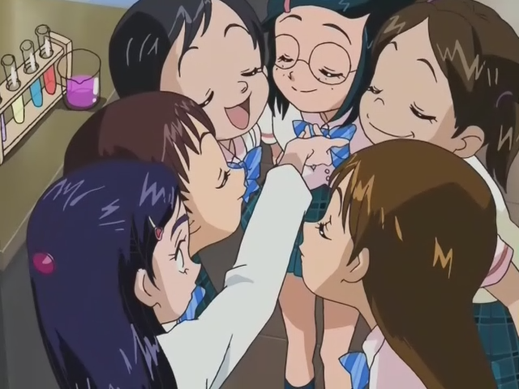   
 Поцелуй с разбега! \*\_\_\*   
    
 Ноу комментс:   
 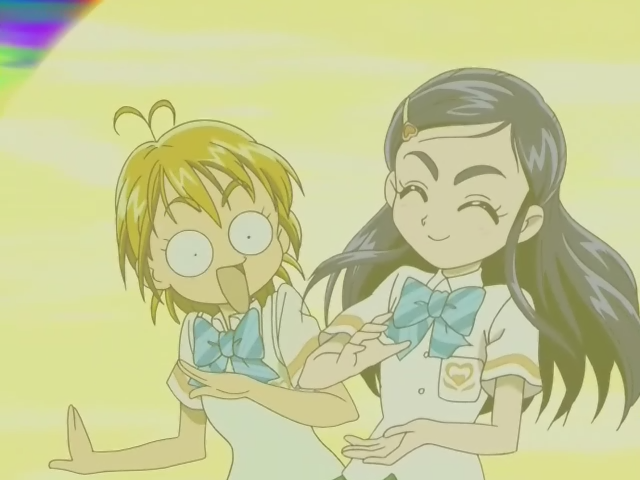   
 Грибочки! Мариса!   
    
 Now, unleash your annihilation of love... MASTER SPARK!   
 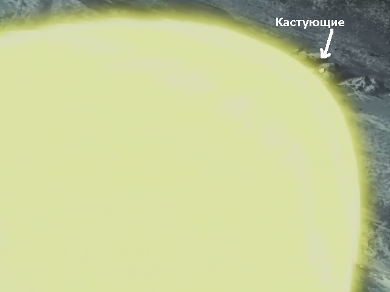   
 Пипец:   
 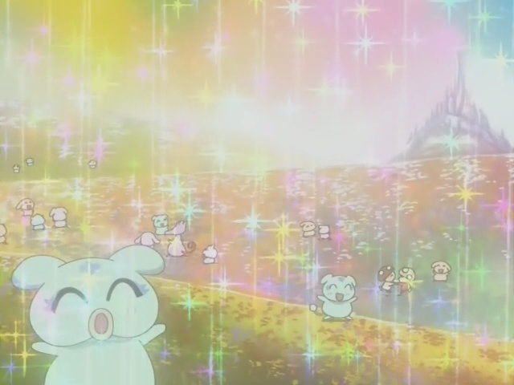    
     
 А так ничего, интересно, помучаю себя ещё.   
  [>>](Futari%20wa%20Precure%20(27)%2028-49%20END)    
    
 <https://diary.ru/~zHz00/p166686926_futari-wa-precure-01-26-27.htm>   
   
 Теги:   
 [[Аниме]]   
 ID: p166686926