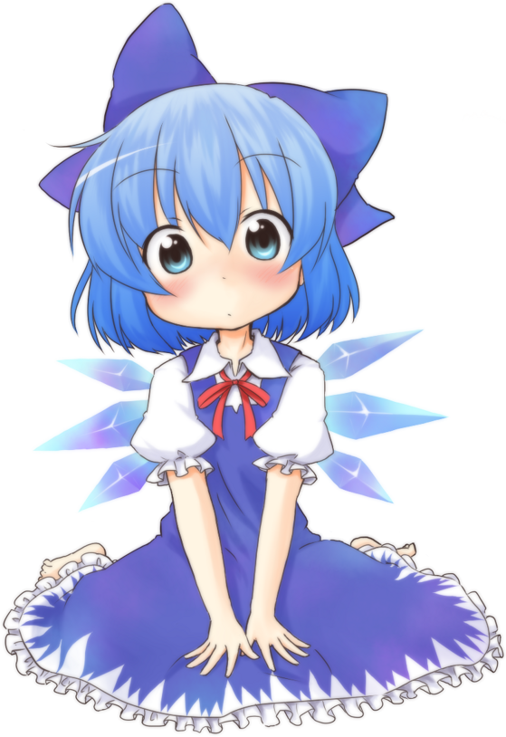

I can
=====

  
2018-08-29, 23:59  
 Для кошки и собаки в японском языке есть соответствующие иероглифы -- 猫 и 犬.   
   
 У них есть кунные чтения, которые знают иногда даже те, кто не знаком с японским языком -- "нэко" и "ину".   
   
 Но есть и онные чтения. Вы когда-нибудь встречали слова, где кошку и собаку надо читать по онному чтению? Скорее всего, нет. Потому что эти слова редко употребляются. Но они есть.   
   
 Слово с собакой я встречал лично в аниме. Один раз. Это слово айкэн -- 愛犬. Как не сложно догадаться, это слово значит "любимый пёс".   
   
 А что же с кошкой? Наверное, должна быть и любимая кошка? Забил в словарь -- айбё:. И правда, любимая кошка тоже есть -- 愛猫.   
  
<https://diary.ru/~zHz00/p216124044_i-can.htm>  
  
Теги:  
[[Японский язык]]  
ID: p216124044  

Комментарии: 3
--------------

  

---

|         #         |              Дата              |                     Автор                     |           ID           |
| --- | --- | --- | --- |
| (1/3) | 2018-08-30, 10:41 | deadlymercury | c734699329 |

  
 а всякие породы не надо читать иначе? всякие акита-ину, сиба-ину и прочие ину?)   
 ^c734699329

---

|         #         |              Дата              |                     Автор                     |           ID           |
| --- | --- | --- | --- |
| (2/3) | 2018-08-30, 11:30 | otonia | c734700218 |

  
  Слово с собакой я встречал лично в аниме. Один раз. Это слово айкэн -- 愛犬. Как не сложно догадаться, это слово значит "любимый пёс".    
 вот тоже хотела в тему собак сказать - при мне японцы всегда говорили "шиба-кен" а не "шиба-ину"   
 ^c734700218

---

|         #         |              Дата              |                     Автор                     |           ID           |
| --- | --- | --- | --- |
| (3/3) | 2018-08-30, 13:26 | RetXiRT suiR@ttig@$ | c734702795 |

  
     
   **EYE CAN?**     
   
      
 ^c734702795