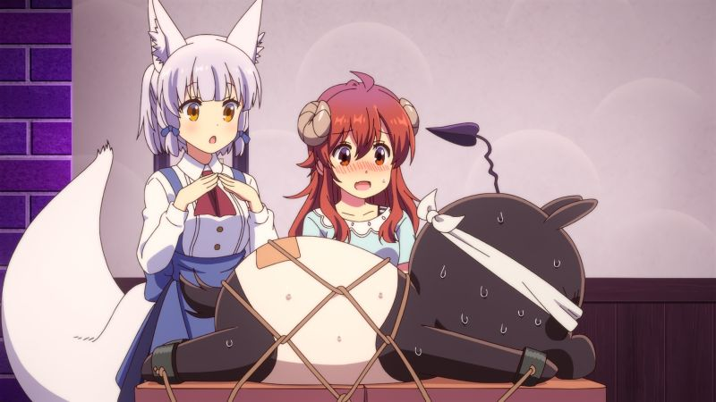
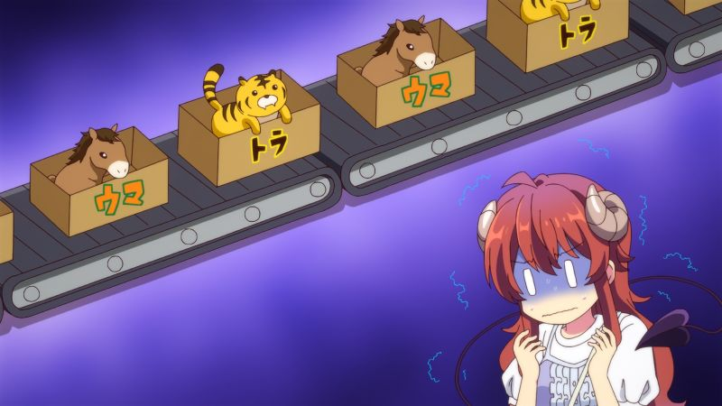
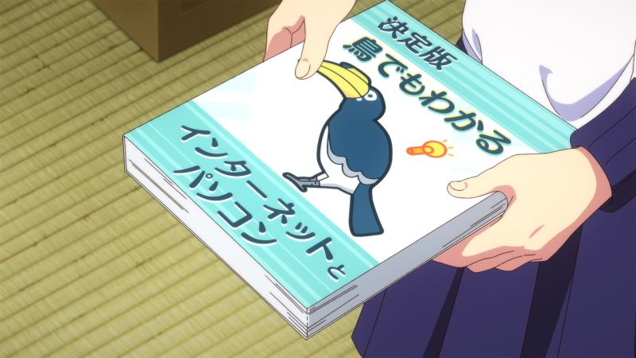
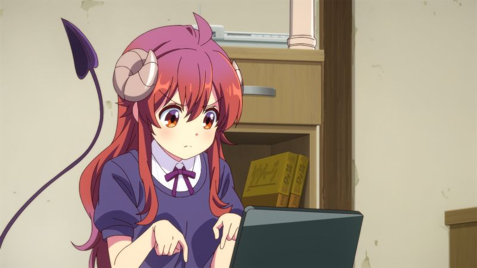
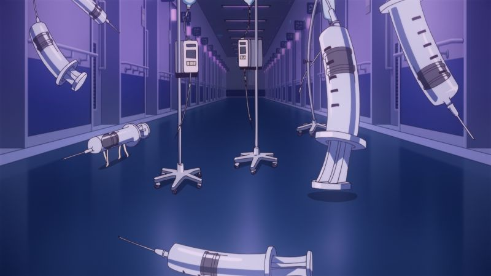
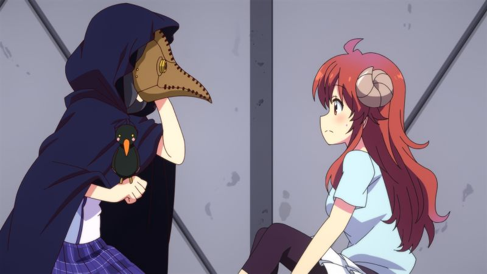

Machikado Mazoku S2 01-12 END
==============================

   
 2023-04-29, 04:24   
   Сколько я анимы посмотрел, а описаний не сделал. Надо себя заставлять! Читателям обзоры не очень интересны, но они интересны мне самому. Это учёт.   
   
  **О чём**    
   
 Это второй сезон сериала про злую девочку-волшебницу и добрую демоницу, которые должны враждовать, но вместо этого няшно дружат.   
   
  **Что думаю**    
   
 От первого сезона я был  [в восторге](Machikado%20Mazoku%2001-12%20END)  . Со вторым всё не так. Он какой-то рваный. Нам показывают несколько важных сюжетных моментов -- приблизительно в начале, в середине и в конце. Но все эти моменты очень плохо склеены какими-то филлерами. Кроме того, они не об'единяются в общую картину. Может быть, меня уже память подводит, но мне кажется, что первый сезон был структурирован гораздо лучше.   
   
 Я был рад провести время с любимыми персонажами, но вынужден сообщить, что качество сезона упало.   
   
  **Рекомендации**    
   
 Ну, тем кто первый сезон не видел -- точно можно не смотреть. Тем же, кто первый сезон видел... не уверен, что стоит смотреть второй.   
   
   
  **Скриншоты**    
  [(скриншоты)](https://zHz00.diary.ru/p221616281.htm?index=1#linkmore221616281m1)       
      
 А вот и новые персонажи. Занимаются непотребствами.   
   
      
 Как тут не вспомнить Дженерейшн П.   
   
      
 Тут тоже важна подпись. Смотрите, что с Момо делают печеньки.   
   
      
 С таким видом читать книжку по чёрной магии -- самое то.   
   
      
 :-О   
   
      
 Известная японская игра слов. Слово "травма" пишется как "тораума", что может быть разбито на два слова, "тора" (тигр) и "ума" (лошадь).   
   
      
 "Руководство пользователя ПК. Поймёт даже птичка!" -- но-но, врановые и попугаи весьма умны!   
   
      
 А вот результат изучения книги.   
   
      
 Все помнят Master Reboot? Там была глава с больницей.   
   
      
 И тебя вылечим! Но вообще чумному доктору ещё нужна трость.   
   
      
     
 <https://diary.ru/~zHz00/p221616281_machikado-mazoku-s2-01-12-end.htm>   
   
 Теги:   
 [[Аниме]]   
 ID: p221616281