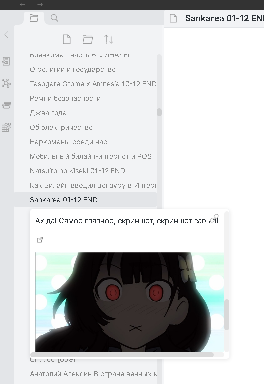
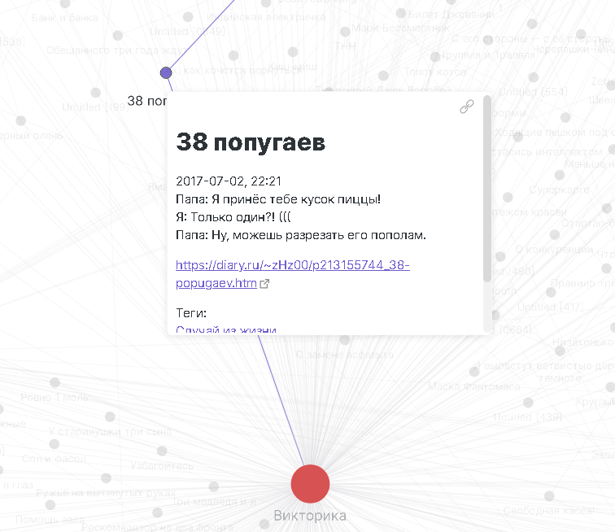

SHINSEKAI: Realization
=======================

   
 2022-01-06, 00:57   
  1 апреля 2013 года я  [написал](SHINSEKAI)  , что создаю секту, главой буду я, а священными текстами будет мой дневник.   
   
 Разумеется, я шутил. Но также я написал, что будет создан отдельный сайт со структурой и навигацией. Такого сайта я так и не создал, но я создал кое-что получше.   
   
 Итак, теперь у меня есть:   
 --  [Набор скриптов](https://github.com/zHz00/diary_ru_dump)  на питоне, позволяющих сделать локальную копию моего дневника   
 -- Или любого другого дневника, что, однако, не проверялось   
 -- Копия будет лежать в формате markdown с возможностью просмотра через  [Obsidian](https://obsidian.md/)  .   
 -- Перекрёстные ссылки по щелчку мыши, картинки, форматирование, полнотекстовый поиск, теги -- и всё это локально! Любая операция выполняется за пару секунд.   
  [(читать дальше)](https://zHz00.diary.ru/p221019785.htm?index=1#linkmore221019785m1)      
 -- Также я создал репозиторий на GitHub, который буду периодически обновлять (не каждый день). Так что если вы хотите локальную копию моего дневника, но не хотите разбираться со скриптами, её можно  [просто скачать](https://github.com/zHz00/zhz_diary_obsidian)  . Об'ём дневника вместе с картинками чуть больше 200 мегабайт. Также есть  [версия с онлайн-картинками](https://github.com/zHz00/zhz_diary_obsidian_nopics)  , она весит всего 12 мегабайт.   
 -- Если вы умеете использовать Git, то обновлять локальную копию можно будет автоматически, что, однако, потребует двукратного расхода пространства на диске из-за локального репозитория. Предупреждаю, что если у вас стоят расширения Гита для Проводника, то надо отключить в папке с дневником отображение статусов на иконках, иначе вы будете очень долго ждать, пока отобразятся все 6000 файлов.   
 Но есть недостатки:   
 -- Увы, с форматированием проблемы. Не поддерживается спойлер. Таблицы не поддерживают rowspan, colspan. Не работает выравнивание.   
 -- На текущий момент не скачиваются комментарии.   
 -- Просматривать записи в хронологическом порядке возможно только в Windows, и то, сначала придётся запустить скрипт update\_times.py . К сожалению, хорошего решения по данному вопросу у меня нет. Я могу вставить дату в имя файла, но тогда нельзя будет сортировать по имени записи, а это недопустимо. Сортировка по дате создания поддерживается только в Windows, потому что время создания файла фиксируется только в системах FAT/NTFS, а в системах ext2/3 не фиксируется. Тем не менее, время фиксируется в ext4 и некоторых других. Допилю эту функцию позже.   
   
    
 Почему я пришёл к такой модели? По трём причинам.   
   
 1. На дайари исторически, ещё с моего прихода в 2011 году, плохо работал поиск по сайту. Потом он перестал работать вообще. Приходилось искать через гугл по слову site:. Но это тоже работало не очень хорошо. После перехода на телеграм я воспрял духом, т.к. внутри телеграма поиск работал хорошо. Но искать я мог только в постах с 2017 года.   
   
 А ищу в своём дневнике я что-то постоянно. Для меня это важнейший источник той информации, которую я забыл. Локальная копия позволяет мне находить любой нужный пост за десять секунд.   
   
 2. Вторая причина -- я хотел консистентный бекап. До переезда дайари на новый движок была функция бекапа. Я ей периодически пользовался. Потом я стал постить в телеграм -- там есть экспорт. Последний бэкап произошёл позже, чем первая запись в телеграме, поэтому бэкап вроде как полный. Но а) он в двух частях б) с ним непонятно, как работать в) в телеграме есть пропуск в пару недель, когда автопостинг не работал, и вручную я тоже не постил. Эти посты есть только на дайари.   
   
 3. Отдельная история -- сохранение всех картинок. Картинки я всегда размещал на имедж-хостингах. Бог знает, сколько из них проебалось за десять лет. При этом хотя большинство картинок это рюшечки типа скриншотов из аниме, есть большое количество изображений, которые дополняют текст поста, или же являются его ключевой частью, как в случае тохо-реплеев из 2012 года.   
   
 Написав скрипт для скачивания картинок, я очень сильно удивился. Всего дневник сейчас содержит около 2000 картинок. Так вот, за 10 лет из них пропало всего-навсего 40 штук. 35 из них мне удалось восстановить при помощи детективных поисков на своих дисках. Несколько, увы, кануло в Лету. Предметом моей гордости является восстановление всех картинок в постах с тохо-реплеями.  [Взгляните](https://zhz00.diary.ru/?tag=296346&n=t)  .   
   
 Так вот, и тут я узнаю про Obsidian. Это программа для ведения заметок. Таких программ много, я вот длительное время работал с KeepNote, например. И он был лучшим из найденных, но он всегда очень сильно тормозил. Obsidian же летает, поддерживает все его функции, и даже больше. Как и KeepNote, он работает локально, а также сохраняет данные в plain text. Оба этих условия были для меня обязательными.   
   
 Посмотрим, как это выглядит. Слева панель с полным списком записей. Можно сортировать по дате (только под windows), по названию. Можно искать:   
   
      
   
 Вот экран с самой записью. Тут видно, как можно переходить по перекрёстным ссылкам:   
   
      
   
 Самая крутая, хотя и не очень полезная фича -- облако записей. Оранжевым обозначены теги. Когда начинаешь лазить по всему этому, то кажется, что это не то паутина, не то плесень.   
   
      
   
 По записям можно бродить, смотреть на связи, делать быстрый просмотр текста:   
   
      
   
 Увы, граф записей был бы гораздо полезнее, если бы можно было подсветить в нём запись, на которую наведена мышка в любом другом окне. Пока я не нашёл, как это сделать. Кроме того. после просмотра записи нельзя легко вернуться к графу: он постоянно перестраивается, и всё оказывается в новых местах.   
   
 Будем надеяться, что авторы сделают эту крутую функцию удобнее.   
      
 <https://diary.ru/~zHz00/p221019785_shinsekai-realization.htm>   
   
 Теги:   
 [[Программы]]   
 [[Программирование]]   
 ID: p221019785