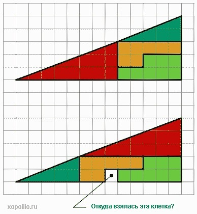

Untitled [0648]
===============

  
2021-04-26, 23:51  
 Из математики известно, что при значениях икс, близких к нулю:   
   
 sin x примерно равен x   
 cos x примерно равен 1   
   
 Это, конечно, так, но всё зависит от необходимой точности. Когда мы на работе собирали разные механические установки, где надо было мерить с точностью 1...10 мкм на масштабах 1 метра, всегда оказывалось, что эти приблизительные равенства недостаточно точные.   
   
 "Да эти детали почти перпендикулярны, ну какая там будет погрешность?"   
 "Да они там почти параллельны, погрешности не будет"   
   
 А вот и нет.   
  
<https://diary.ru/~zHz00/p220679212_untitled-0648.htm>  
  
Теги:  
[[Борьба с техникой]]  
[[Наблюдения]]  
ID: p220679212  

Комментарии: 4
--------------

  

---

|         #         |              Дата              |                     Автор                     |           ID           |
| --- | --- | --- | --- |
| (1/4) | 2021-04-27, 09:11 | Стороной | c752012344 |

  
 По сути тоже проблемы с точностью на картинке:   
   
    
 ^c752012344

---

|         #         |              Дата              |                     Автор                     |           ID           |
| --- | --- | --- | --- |
| (2/4) | 2021-04-27, 09:18 | zHz00 | c752012370 |

  
  [Стороной](https://1047.diary.ru "Арфы нет - возьмите бубен!")  , именно. Хотел дать заголовок в честь этой загадки, но не уверен, что у неё есть специальное название.   
   
 Вот если такая погрешность устраивает -- добро пожаловать в мир sin x = x .   
 ^c752012370

---

|         #         |              Дата              |                     Автор                     |           ID           |
| --- | --- | --- | --- |
| (3/4) | 2021-04-27, 13:08 | RetXiRT suiR@ttig@$ | c752013418 |

  
 Если посмотреть внимательно, то линия, образуемая гипотенузами красного и тёмно-зеленого треугольников - не прямая, а угол, на первой фигуре он направлен внутрь, а на второй - наружу. Вот здесь и кроется наёбка, отсюда и берётся "лишнее" пространство на второй фигуре. Т.е. это не парадокс, а тупо нечестно поставленный вопрос. Исессно, специального названия для изначально неправильно сформированной задачи нет.   
 ^c752013418

---

|         #         |              Дата              |                     Автор                     |           ID           |
| --- | --- | --- | --- |
| (4/4) | 2021-04-28, 14:21 | zHz00 | c752019552 |

  
  [RetXiRT suiR@ttig@$](https://Hellspawn.diary.ru "Atomicautionuclear")  , это целый тип головоломок из книжек типа "занимательная математика для школьников", когда из-за немного отличающихся углов и длин в разных комбинациях деталей образуются дыры. Есть и головоломки "в натуре", например, вот такая:   
   
  [www.youtube.com/watch?v=tC0BSmMqqWQ](https://www.youtube.com/watch?v=tC0BSmMqqWQ)    
 ^c752019552