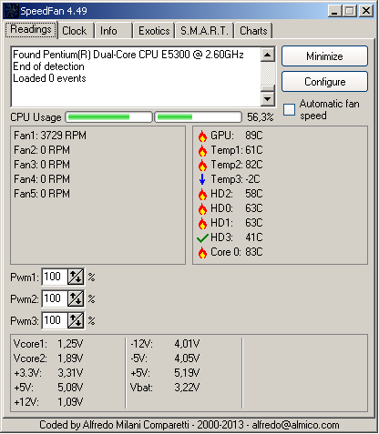

Untitled [272]
==============

  
2014-03-06, 23:41  
 Мышка вместе со своим ковриком лежит у меня прямо на системном блоке. И это к лучшему.   
   
 Работал я работал, чувствую, что-то коврик больно тёплый. А под ним -- ещё теплее. и вообще весь комп тёплый. Такого быть не должно. Запускаю SpeedFan. Вижу охренительную картину:   
      
 Подозрение: сдох кулер.   
 Выключил, открыл (температура сразу -10 градусов). Оказалось:   
 1. Кулеры на видяхе и на процессоре пашут.   
 2. Кулер в БП не шевелится.   
 3. Были ещё 2 кулера, исторически располагающиеся на винчестерах, так они вообще оказались отключены (подключил).   
   
 А дело в том, что ток воздуха наружу (или снаружи внутрь) создаётся исключительно кулером БП. Остальные просто гоняют воздух внутри.   
   
 Вскрыл БП, кулер пальцем вращается с трудом. Пыль. К счастью, кулер БП разбирался. После "протирки оптических осей" кулера ацетоном, а потом намазывания (оси) машинным маслом, кулер заработал. Температура резко упала.   
   
 Честно говоря, я вообще удивлён, что с неработающим кулером БП комп не загнулся и не выключился аварийно. Если бы я не держал мышку на системном блоке, возможно, обнаружил бы неисправность нескоро. И удивлялся бы странным глюкам и внезапным отключениям.   
   
 Мораль тут такова: температуру компа необходимо мониторить. Все современные компы содержат в себе датчики температуры. Есть множество программ, которые позволяют узнать температуру не тактильным способом.   
  
<https://diary.ru/~zHz00/p196024609_untitled-272.htm>  
  
Теги:  
[[Борьба с техникой]]  
ID: p196024609  

Комментарии: 3
--------------

  

---

|         #         |              Дата              |                     Автор                     |           ID           |
| --- | --- | --- | --- |
| (1/3) | 2014-03-08, 13:22 | deadlymercury | c660890086 |

  
 Отключаться аварийно он не будет. Диски просто сдохнут от работы при температуре градусов в 60-65, проц и гпу будут в троттлинг уходить и им ничего не будет.   
 Может отключиться БП, но у него запасы по нагреву достаточно большие. Другой вопрос, что когда ток воздуха в корпус и из корпуса создается куллером БП - это лютый треш...   
 ^c660890086

---

|         #         |              Дата              |                     Автор                     |           ID           |
| --- | --- | --- | --- |
| (2/3) | 2014-03-08, 13:40 | zHz00 | c660891073 |

  
 >>Другой вопрос, что когда ток воздуха в корпус и из корпуса создается куллером БП - это лютый треш...   
  [deadlymercury](http://crazysupp.diary.ru "Записки безумного саппорта")  , ну, так сложилось исторически. Ок, там есть ещё одно посадочное место (правда, маленькое) -- поставлю ещё 1 кулер для угона воздуха наружу.   
   
 >>Диски просто сдохнут от работы при температуре градусов в 60-65   
   
 Спасибо, не знал температуры выхода из строя дисков. Знал, что микросхемы до 100 градусов будут работать. Ну, диски вроде пока не сдохли.   
 ^c660891073

---

|         #         |              Дата              |                     Автор                     |           ID           |
| --- | --- | --- | --- |
| (3/3) | 2014-03-08, 14:07 | deadlymercury | c660892542 |

  
 Ну так он и не сразу сдохнет) При температурах выше 50-60 начинается деградация поверхности диска, чем выше температура - тем быстрее деградирует.   
 Так что если винт прогрелся до 60 - это повод быстренько выключить комп и изучить вопрос "какого хрена?"    
 Еще температурные показатели прописываются у производителя винта и их превышение (как и значения перегрузок) фиксируются - отказ в гарантии.   
 ^c660892542