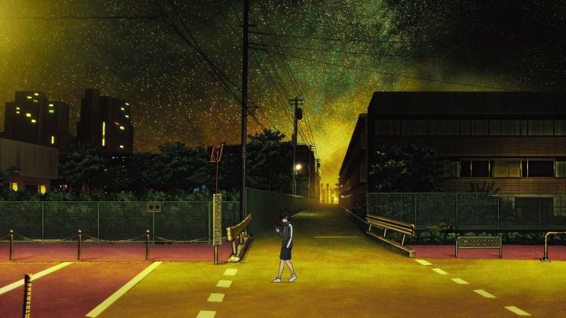
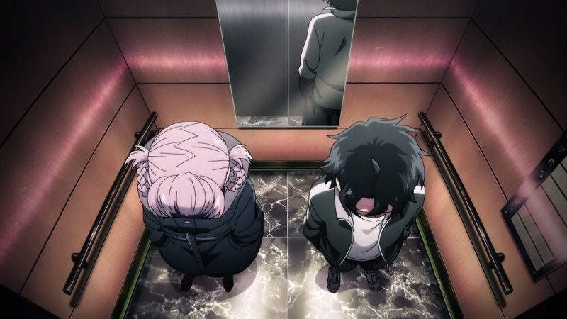
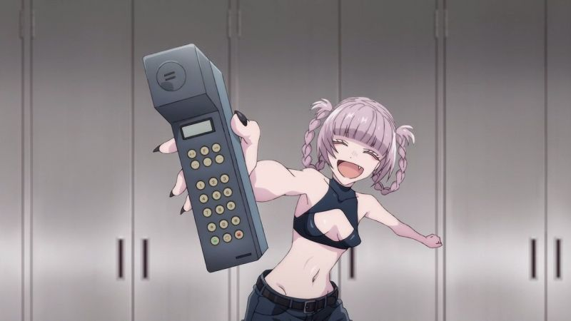
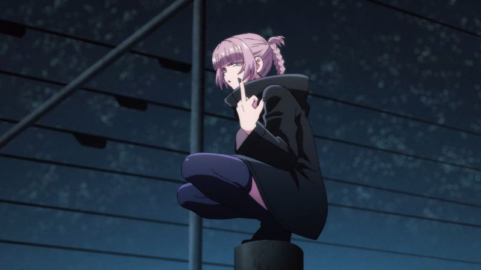
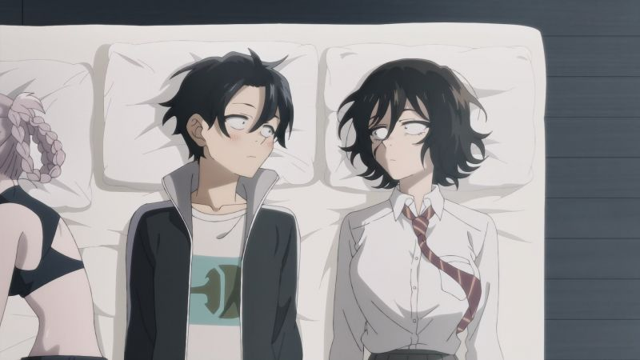
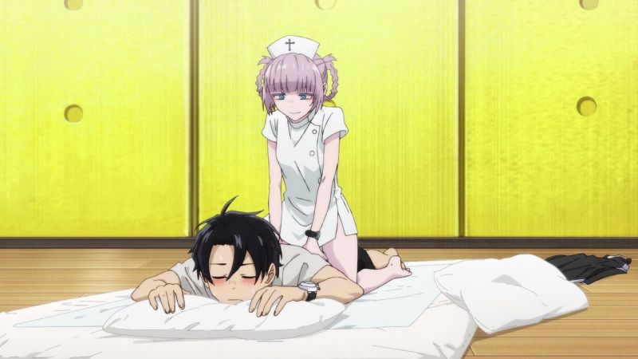
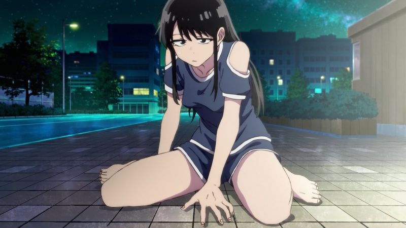
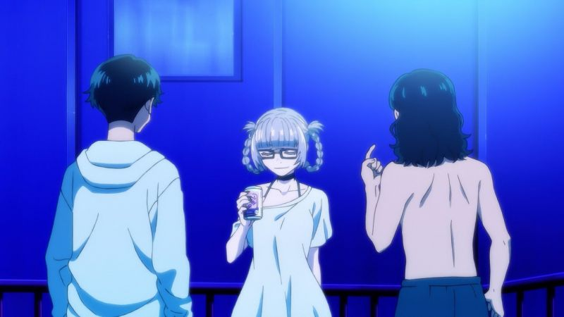
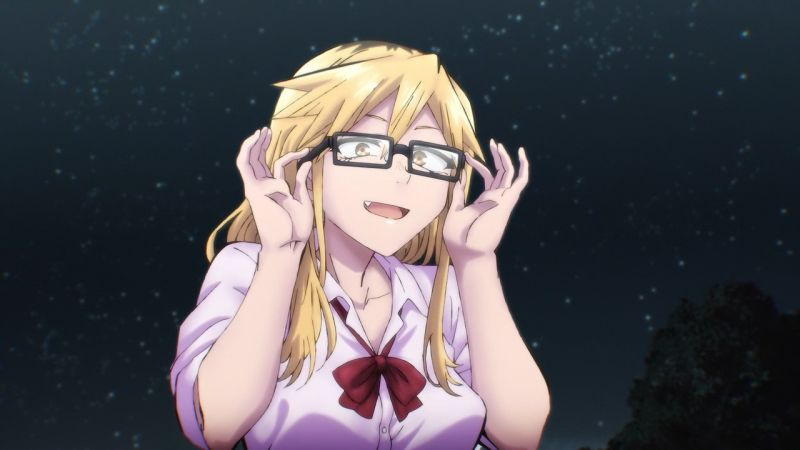
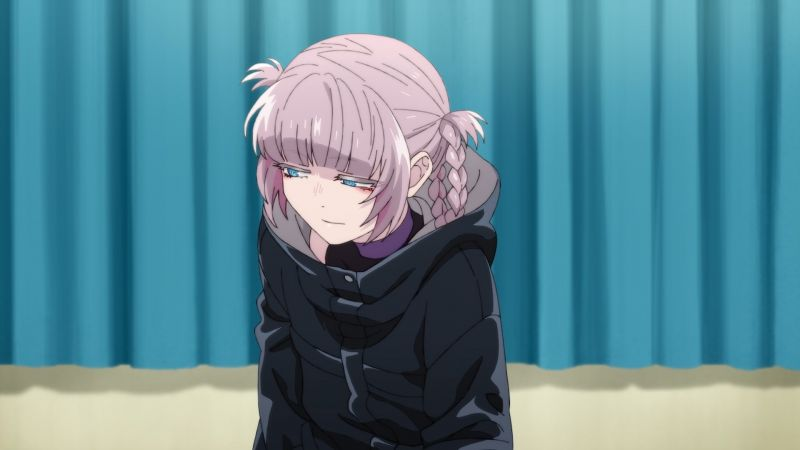

Yofukashi no Uta 01-13 END
===========================

   
 2022-10-05, 02:53   
  Заглянув в папку со скриншотами, я обнаружил, что не составил обзоры на кучу сериалов чуть ли не с 2021 года. Штош, начнём с только что досмотренного.   
   
  **О чём**    
   
 Если бы Белла была мальчиком, а Эдвард -- девочкой...   
   
 На самом деле, конечно, всё не так. У мальчика травма: ему впервые призналась девочка, а он что-то и не знает, что ответить. Он решил бросить школу, настолько его впечатлила ситуация. А чтобы с девочкой случайно не встретиться, мальчик решил, что будет выходить на улицу только ночью...   
   
 Это ему, однако, не помогло. Девочку он всё равно встретил, но другую. Как говорится, "ночь темна и полна ужинов".   
   
  **Что думаю**    
   
 У сериала есть несколько особенностей, или даже странностей.   
   
 Первое -- это визуальное оформление. Все ночные сцены очень яркие и красочные. Дневных сцен в сериале мало по понятным причинам, но те, которые есть -- оформлены в бледных цветах. В этом есть элемент истины, но всё же в жизни контраст между днём и ночью не такой большой.   
   
 Второе -- это эмоциональная атмосфера. Какая атмосфера предполагается у сериала, где половина персонажей -- воинственные вампирши? И эти вампирши пытаются убить то друг друга, то главного героя, то кого-нибудь ещё? Так вот, атмосфера у сериала очень спокойная -- и успокаивающая. И это не то чтобы уверенность в завтрашней ночи. Это то ли фатализм, то ли безразличие.   
   
 Ну и, наконец, сам подход к вампиризму. Сейчас будет небольшой спойлер, хотя известно о нём становится почти в самом начале. В этом сериале чтобы стать вампиром, недостаточно быть покусанным. Птенец перед обращением должен влюбиться в своего будущего сира. Не встречал такой концепции раньше. В околоромантическом сериале эта концепция выглядит очень органично и добавляет напряжения.   
   
  **Рекомендации**    
   
 Это вам повседневность, чтобы коротать вечера.   
   
  **Скриншоты**    
  [(скриншоты)](https://zHz00.diary.ru/p221350986.htm?index=1#linkmore221350986m1)       
      
 Вот пример красочной ночи.   
   
      
 Одна из первых встреч главных героев. Как видим, у Надзуны нету отражения. Как мне сказал s19, это значит, что вампиров можно сфотографировать на мыльницу, но нельзя на зеркалку.   
   
      
 Вампиры живут долго, и сотовые телефоны у них тоже живут долго.   
   
      
 Этот скриншот сделали все.   
   
      
 Сообразили на троих.   
   
      
 В человеческой культуре образ вампиров часто романтизируется. Эти интеллигентные кровососущие демоны живут в своё удовольствие и делают что хотят. Вампиры в Yofukashi не такие. Еду они добывают самостоятельно, это так, но за жильё надо платить. Вампирам приходится работать! Надзуна работает массажисткой, что и изображено на данной картинке.   
   
      
 Сериал не совсем гарем. Да, в сериале полно девушек, и все они симпатичные, и все интересуются главным героем. Но интерес этот бывает разным.   
   
      
 Ещё один скриншот, которые все сделали.   
   
      
 Вампирша, ведущая себя как последняя шлюха, оказалась самой нежной и романтичной.   
   
      
 :3 Ну ладно, самой нежной и романтичной ПОСЛЕ Надзуны.   
      
 [конец]   
    
 <https://diary.ru/~zHz00/p221350986_yofukashi-no-uta-01-13-end.htm>   
   
 Теги:   
 [[Аниме]]   
 ID: p221350986