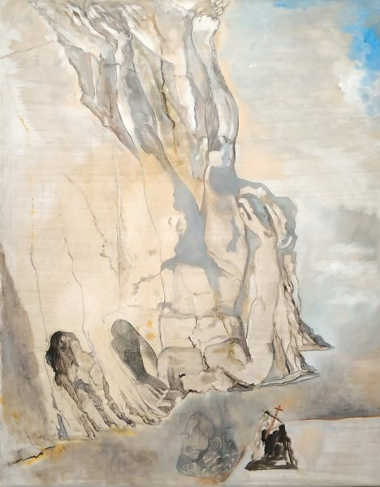
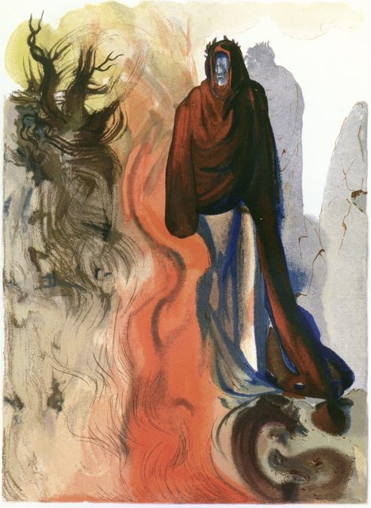

Выставка "Сальвадор Дали. Магическое искусство"
================================================

   
 2020-02-16, 23:59   
  Выставка в Манеже до 25 марта с.г.   
   
 Очередь в 13 часов была не очень большая, человек 50. А в 17 часов уже человек 250. Но ладно.   
   
  [(читать дальше)](https://zHz00.diary.ru/p219043057.htm?index=2#linkmore219043057m2)      
   
  **Про магазин**    
   
 Заходим. Обычно на выставках всегда есть киоск со значками и прочим, посвящённым выставке. А тут только один маленький лоток с непонятными перстнями за 26 тыщ (!) и киоск с общими товарами по Манежу. Но всё оказалось совершенно иначе. Магазин был -- огромный -- уже за контролем билетов. Было там много чего, но многое стило конских денег. Например, организаторы (кстати, все девушки) ходили в прикольных фуфайках с картиной soft self-portrait. В магазине -- 3,5 тыщи. Сорочка (кажется, женская) -- 12 тыщ. Матрёшка с картинками Дали -- 9 тыщ. Повторы перстней с теми же ценами. Вот тебе и Дали-атрибутика. Были, конечно, предметы и с условно нормальными ценами. Но не было нескольких важных вещей.   
   
 Были тапочки, но не было повязок на глаза.   
   
 Были кружки, но все с неинтересными картинками.   
   
 Были книжки, но не было самой главной книжки -- "50 секретов магического искусства", гравюры из которой были выставлены в зале.   
   
 А потом я обнаружил огромную коробку с надписью Dali Tarot. Вообще-то эта колода у меня уже есть, но тут в коробке лежала ещё книжка (всего в магазине было 3 экземпляра, один раздраконенный для осмотра посетителями; перед уходом с выставки обнаружил, что один хороший экземпляр исчез). Коробка с колодой и книжкой стоила 9 тыщ. Колода мне была не нужна по понятным причинам, но книжка отдельно не продавалась. Я заглянул в книжку. Большую часть книги составляли трактовки карт на трёх языках (правая часть разворота) и репродукции самих карт (левая часть разворота). Но в тексте с правой части был очень интересный маленький раздельчик -- Pictorial Sources.   
   
 Здесь надо пояснить, что же такое Dali Tarot.   
   
  [(врезка о колоде)](https://zHz00.diary.ru/p219043057.htm?index=1#linkmore219043057m1)    Это колода карт Таро, которую действительно нарисовал Сальвадор Дали. История довольно мутная, вот тут можно посмотреть сами карты и прочитать немного про их историю:   
  [www.dali-genius.ru/Dali-Tarot-Cards.html](http://www.dali-genius.ru/Dali-Tarot-Cards.html)    
   
 Когда смотришь на такую колоду, сразу возникает вопрос, а как гадать? Что она как арт-об'ект охуенная -- это понятно. Я спрашивал нескольких человек, что же это за колода такая. Мне все ответили, что это Папюс. По нумерации СА -- да. По буквам иврита -- да. Про астрологию французской школы ничего сказать не готов. Но посмотрите на МА! Во-первых, они прорисованы, а не просто содержат символы масти в необходимом количестве. Во-вторых, они прорисованы во многом по английской школе. Не точно, но во многих картах узнаются ассоциации. Сравните с классическим таро Уэйта:   
  [magiachisel.ru/KartyTaro/GalereyaTaro.aspx?kl=1](https://magiachisel.ru/KartyTaro/GalereyaTaro.aspx?kl=1)    
   
 Иии... так какая же это колода? Ладно, предположим, что французской школе всё равно, есть изображения на МА или нет, главное чтобы символы масти были на месте. Но посмотрите на рыцаря денариев (caballero de oros). На карте нет ни одного денария, хотя должен быть.   
   
 Когда я её только купил, я пытался её как-то использовать. Для теста я использовал стандартную технику -- "карта дня". В день смерти ssvda я вытащил "Башню" (это полностью соответствовало событию). Ну, замечательно, колода работает, лол.     
   
 В общем, для практического применения колода проблемная. Если же внимательно посмотреть на МА, то можно заметить, что многие карты являются как бы коллажами других картин. Но что это за картины? Этот вопрос очень важен для меня, как потенциального пользователя колоды. Если знать исходники карт, можно лучше понять, что с колодой делать. Но выяснить исходники -- это целая исследовательская работа искусствоведа. А не меня.   
   
 И кое-кто эту работу проделал! Это был автор той книги, которая была в магазине -- Йоханесс Фибиг (Johannes Fiebig). Раздел Pictorial Sources из этой книги мне был нужен позарез, а остальное -- нет. 9 тыщ рублей!   
   
 В общем, да. На контроле билетов мне сказали, что фотографировать без вспышки можно во всех залах выставки. Поэтому я просто взял и внаглую отфотографировал всю книжку. Не целиком страницы, конечно, а чтобы этот раздел влезал. Я об этом ещё потом напишу. В общем, оооочень плодотворно я на выставку зашёл.   
   
  **Про саму выставку**    
   
 К организации у меня почти нет никаких претензий. Очень хорошо сделано освещение картин. Я сначала даже подумал, что это репродукции, подсвеченные лампами изнутри. Но нет, просто лампы подсветки имели фигурную форму освещения -- точно по размеру картины. Я до этого такого никогда не видел. Картина подсвечена -- а вокруг всё темно. Единственный настоящий косяк -- перепутали местами изображения в одной из стереоскопических пар. Ну и ещё небольшой недостаток -- аварийные выходы слишком сильно били светом в глаза на фоне полумрака основного помещения.   
   
 Выставка по составу очень мощная. Предыдущая такая же крутая была  [в 2011 году](Сальвадора%20Дали%20псто)  . По сравнению с той повторов не было или почти не было.   
   
 Первый зал содержит ранние работы. Я шучу, что прежде, чем художник сможет рисовать плохо, сначала он должен научиться рисовать хорошо (про всяких экспрессионистов и импрессионистов). Так вот, Дали всегда рисовал хорошо. Одна из странных картин в этом зале -- "четыре жены рыбаков":   
   
        
 Возникает вопрос -- а где четвёртая жена?   
   
 Центральный зал -- в основном, сюрреализм. С этими картинами надо работать, разбирать, искать детали. Но даже без разбора они производят очень сильное впечатление. Вот, например, это -- эскиз декорации "Безумный Тристан":   
   
        
 В третьем зале расположены переработки классических произведений. Дали вообще часто обращался к классике. В этом зале я нашёл одну картину, загадку которой мне удалось разгадать. Картина -- "по мотивам Давида":   
   
        
 В одном из дополнительных залов были иллюстрации к Божественной комедии Данте, которую я так и не прочитал. Сначала я их смотрел беспорядочно, а потом стал смотреть по порядку и меня вштырило от последовательного просмотра картин Ада. Я почти почувствовал, как спускаюсь всё ниже и ниже. Катабасис. И в конце путешествия вниз была картина, которая называлась "У врат города Дит". Тогда я почувствовал, что путешествие подошло к концу. Это был охуенно:   
   
        
 Потом оказалось, правда, что город Дит это только седьмой круг, а не девятый. Зато вот ещё что там было:   
   
        
 Эта картина обозначена "колдуны и прорицатели". Восьмой круг, четвёртая щель. Если что, ищите меня там.   
     
    
 <https://diary.ru/~zHz00/p219043057_vystavka-salvador-dali-magicheskoe-iskusstvo.htm>   
   
 Теги:   
 [[Выставки]]   
 ID: p219043057