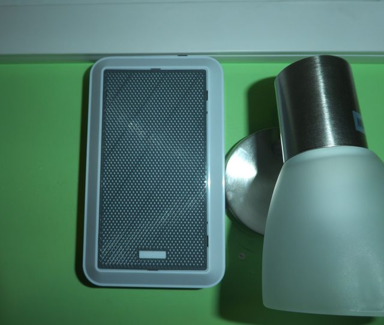
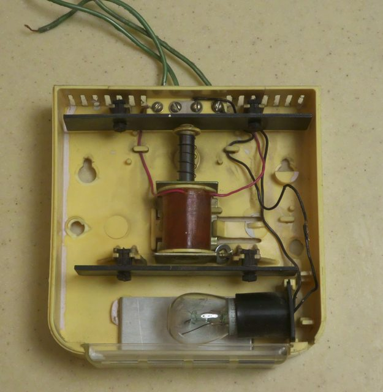
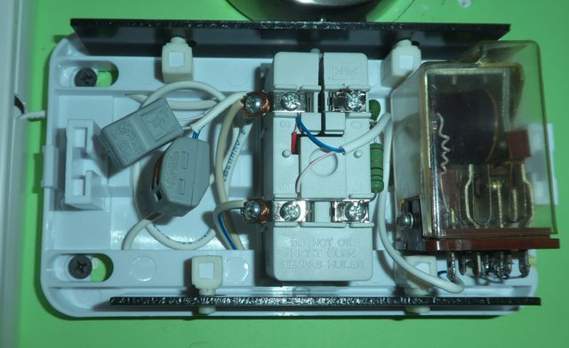
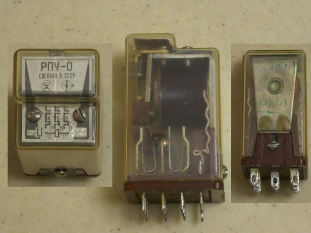
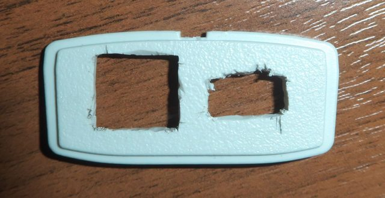
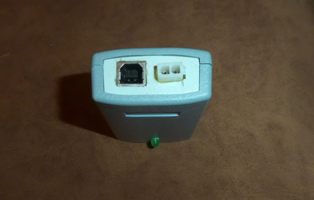
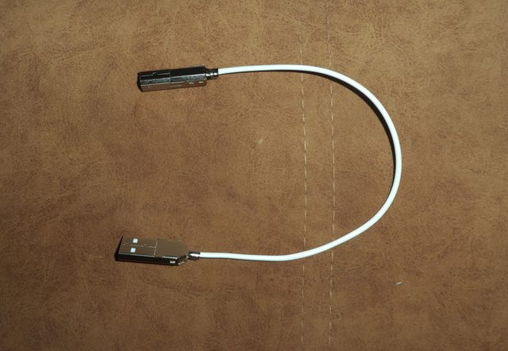
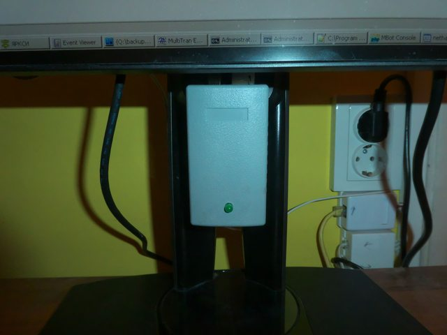

Глупый дом: световая индикация дверного звонка
===============================================

   
 2019-11-18, 23:59   
  Папа мне давно говорил, что надо лампочку себе повесить, чтобы я знал, когда дверь открывать, а то сижу в своих наушниках и ничего не слышу. Кроме того, периодически происходили  [эксцессы](На%20эмалевой%20стене)  . Ну и третий момент был в этой истории -- невротический. Иногда сидишь, и кажется, что кто-то в дверь звонит. Приходится снимать наушники и идти проверять. А там пусто.   
   
        
 На первой картинке дезинформация, дальше будет понятно, в чём она заключается.   
  [(читать дальше)](https://zHz00.diary.ru/p218583189.htm?index=1#linkmore218583189m1)      
 Готовился я к этой самоделке давно -- ещё на этапе прокладки проводов в прихожей провёл дополнительный сигнальный проводок от звонка до компьютера. Но непосредственно ввёл в эксплуатацию только вместе с установкой нового звонка.   
   
 Я, пожалуй, не буду рисовать схему электрическую принципиальную, так она проста. Опишу словами. Эта поделка -- всего лишь вариация  [автоматического освещения щитка](Глупый%20дом%20как%20я%20собирал%20электрощиток)  (хотя для автоматической подсветки я схему тоже не привёл).   
   
 Как я узнал, бывают электромеханические звонки, которые сразу работают от 220 вольт, а бывают электронные на 5 вольт, беспроводные и прочие. Поскольку старый звонок у нас был простой советский на 220, то новый я тоже приобрёл на 220. Вот, взгляните на то, как был устроен старый звонок 1980 года:   
   
        
 Вид сзади:   
   
        
 А вот как устроен внутри новый звонок:   
   
        
 Как видно, различия минимальны.  На самом деле видно не очень; в новом звонке в центральной коробочке точно такой же соленоид и такая же пружинка.  В старом звонке была лампочка, которая включалась, если дёрнуть за верёвочку (изнутри квартиры). Сейчас я попросил строителей вывести управление этой лампочкой на отдельный выключатель, что они и сделали. После установки нового звонка лампочку мы повесили рядом отдельно, таким образом эта лампочка с первой фотки никак не связана с нажатием на клавишу звонка снаружи квартиры. И она не имеет никакого отношения к поделке, о которой я пишу.   
   
 Но что это за прозрачная коробочка внизу звонка? (на фото -- справа) Это брутальное реле РПУ-0. Оно изготовлено в 1976 году.   
   
        
 Этот малыш имеет катушку на 220 вольт и может переключать токи до 4 ампер по трём парам контактов на два состояния (NO/NC). Но я буду использовать токи в районе 20 мА и только одну пару контактов в одном состоянии. Зачем же я поставил такое мощное реле? Потому что его нашёл папа у себя в шкафу и выдал мне.   
   
 В общем, идея такая. Звонок и реле я подключил параллельно. Когда кнопку звонка нажимают, одновременно со звоном перекидывается реле. А к нему подключён тот самый сигнальный провод (кабель КСПВ 0.4 мм  2  , две жилы), который идёт к компьютеру. Дальше я, в принципе, что угодно могу с ним делать. Я сначала даже подумал, что для зажигания лампочки сечения 0.4 будет достаточно даже для 220 вольт -- и типа можно обойтись без реле и подключить лампочку к КСПВ напрямую. Догадался я об этом, когда уже приклеил и подключил реле. Поэтому я просто придумал себе отговорку, что плохо, когда 220 вольт идут через всю квартиру по КСПВ. Хотя монтаж внутри звонка у меня сделан тем же самым растогоканным КСПВ. Он подходит по току обмотки реле.   
   
 Напряжение инженерной мысли привело к идее, что поскольку индикацию звонка в дверь я собираюсь осуществлять одним-единственным светодиодом, а компьютер будет находиться рядом с ним, то надо бы сделать питание этого светодиода по USB. Более того, поскольку в мой монитор встроен USB-хаб, питающийся от кабеля питания монитора, то при установке светодиода рядом с монитором (как я планировал), питание можно будет взять совсем рядом. Из этого следовала конструкция индикаторного блока. Это должна быть коробочка со светодиодом и двумя раз'ёмами. Один для питания -- USB Type B, а другой -- сигнал от реле (два контакта; я поставил какой-то MATE-N-LOCK, потому что он визуально был похож, на то, что надо... до этого не встречал такой тип). С этой целью в Чип и Дипе был приобретён корпус подходящего размера за 200 рублей. Это самая дорогая деталь поделки. В коробочке почти ничего нет: светодиод, нагрузочный резистор и два коннектора. Нагрузочный резистор стоит последовательно со светодиодом, чтобы на этом резисторе падало лишнее напряжение -- и ток на светодиоде не становился слишком большим. Светодиодную ленту я в своё время подключал без такого резистора, потому что там эти резисторы запаяны на саму ленту.   
   
        
 Отдельной проблемой были отверстия в боковой части корпуса. Они должны были быть квадратными, а сверло делает только круглые. Поэтому пришлось насверлить кучу дырок, а дальше работать ножом. "Квадратные" дырки получились очень кривые:   
   
        
 Тем не менее, свою функцию они выполняли. Чтобы раз'ёмы не вываливались, я их приклеил эпоксидкой. Получилось почти прилично:   
   
        
 Финальный штрих -- USB-кабель. Раз'ём монитора располагается буквально в 15 см от точки подключения. Таких коротких кабелей не делают. Поэтому я сделал 20-сантиметровый шнурок, который даёт только землю и пять вольт:   
   
        
 Коробочку я приклеил двусторонним скотчем к подставке монитора. Вот как это выглядит:   
   
        
 Работает адекватно -- пока кнопка звонка нажата, светодиод горит. Как только отпускают -- гаснет. Общая стоимость "устройства" составила менее 500 рублей. Следующая самоделка будет поинтереснее, уже с микроконтроллером.   
     
    
 <https://diary.ru/~zHz00/p218583189_glupyj-dom-svetovaya-indikaciya-dvernogo-zvonka.htm>   
   
 Теги:   
 [[Борьба с техникой]]   
 [[Электроника]]   
 [[Ая]]   
 [[Статьи]]   
 ID: p218583189