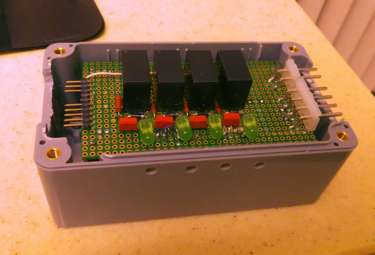
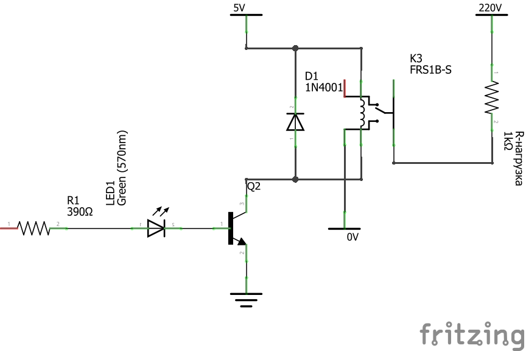
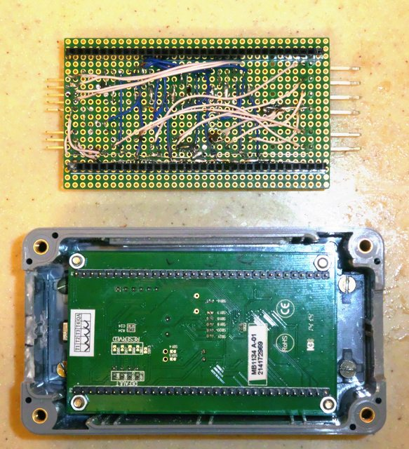
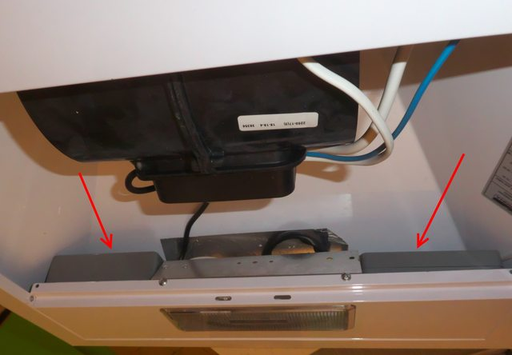
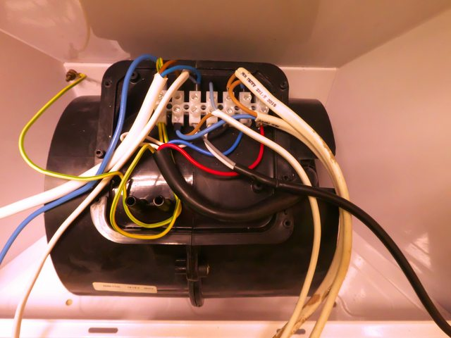
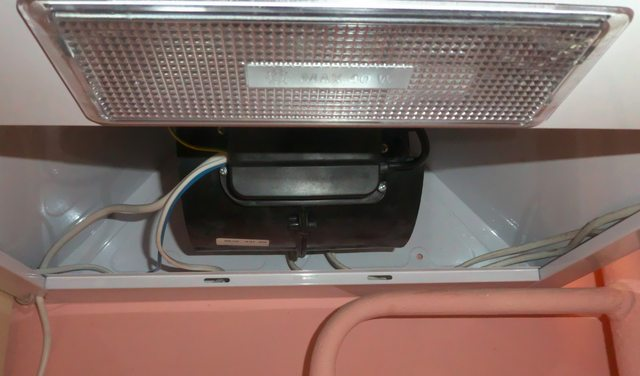
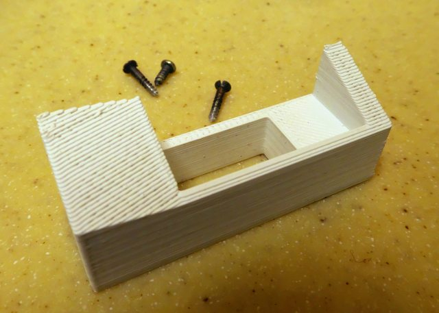
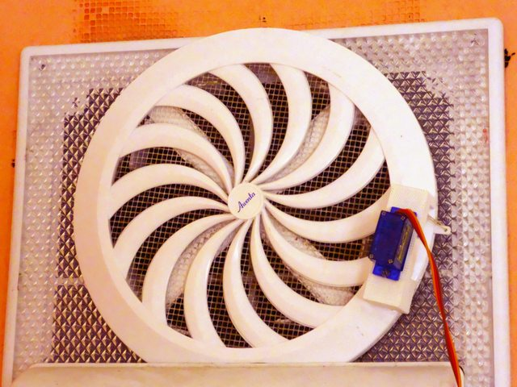

Глупый дом: управление задвижкой вентиляции для кухонной вытяжки
================================================================

  
2020-02-11, 23:59  
 Придумать это оказалось гораздо проще, чем сделать.   
   
        
 Дано:   
 Вытяжка KRONASteel BELLA 500 White (около 5000 р.) -- 1 шт.   
 Окно вентиляционной решётки с рычажком (около 100 р.) -- 1 шт.   
 Вытяжка подключена к окну, см. ниже.   
   
 Проблема:   
 Чтобы вытяжка гнала воздух в вентиляцию, решётка должна быть закрыта. Чтобы вентиляция нормально работала, когда вытяжка выключена -- решётка должна быть открыта.   
   
 На второй квартире проблема решена папой при помощи специальной верёвочки. Если дёрнуть её с одной стороны -- решётка закрывается, с другой -- открывается. Это метод невозможен на первой квартире: установке верёвочки препятствуют окружающие предметы, в особенности шкаф. Если же всё-таки попытаться это сделать, потребуется изобретать систему блоков (!), что мне неинтересно. Мне интересно было сделать управление по кнопке. Естественно, положение задвижки следует менять с помощью сервопривода, подключённого к микроконтроллеру. Сначала я собирался поставить кнопочку на стенку. Нажимаешь -- сервопривод перемещает задвижку. Я стал думать, куда прикрутить кнопку и блок с микроконтроллером. В это время мой взгляд упал на саму вытяжку. На ней было целых пять кнопок. И состояние этих кнопок однозначно определяло состояние задвижки. Так мне пришла идея перевести вытяжку полностью на микропроцессорное управление.   
   
  [(читать дальше)](https://zHz00.diary.ru/p219018636.htm?index=1#linkmore219018636m1)     **Электроника**    
   
 Разобрав вытяжку, я обнаружил, что она устроена просто, как валенок. Кнопки включения-выключения были сделаны по образцу советского радиоприёмника (настоящие РАДИОКНОПКИ). Три кнопки переключали скорости. Одна сбрасывала предыдущие три. И одна работала в режиме флажка -- выключала лампочку. Все кнопки просто подавали 220 вольт на нужные входы мотора (которых было три) или лампочки (которых было один). Это означало, что необходимо было реализовать управление 220 вольтами с помощью микроконтроллера. После чтений интернетов и консультаций с коллегами-электронщиками я выбрал вариант с реле. Ещё можно было сделать симисторное управление, но это я отложу для следующей поделки.   
   
 Принцип простой. GPIO-ножка работает в режиме push-pull. К ней подключен ключ на транзисторе, который замыкает-размыкает управляющую катушку реле. Дополнительно стоят:   
 -- защитный диод, чтобы при разрядке катушка не убивала транзистор и GPIO;   
 -- токоограничивающий резистор, чтобы ток не убивал база-эмиттерный переход;   
 -- светодиод для отладочных целей, чтобы было видно состояние реле (светодиод я придумал уже после запайки первого канала, но ему нашлось место).   
   
 Принципиальная схема одного из каналов приведена ниже:   
   
        
 Три скорости+лампочка означали, что надо сделать 4 канала управления. Переводить управление лампочкой на микроконтроллер не было никакой необходимости, но это перспективное решение, т.к. при желании я смогу синхронизировать включение-выключение лампочки с основной подсветкой рабочей области кухонного гарнитура.   
   
 В качестве контроллера был выбран STM32F0 (ARM Cortex-M0). Вот почему:   
 -- я уже умею работать с STM32, в т.ч. с сервоприводами (по работе), поэтому брать другую архитектуру смысла нет;   
 -- что-либо мощнее для такой простой задачи брать смысла нет;   
 -- в комплект Discovery именно для него входит монтажная плата подходящего размера;   
 -- это самый дешёвый комплект Discovery на STM32, стоит примерно 1000 рублей.   
   
 Скорее всего, если бы я задался целью сделать как можно дешевле, это бы удалось, возьми я какой-нибудь клон Ардуионо Нано на ATMega (250-500 р.). В данном случае, однако, я решил, что я лучше доплачу, чем буду курить новую архитектуру.   
   
 По остальным комплектующим:   
 -- сервопривод был взят SG90, т.к. я уже умею с ним работать. Сервопривод, конечно, говно. Во-первых, у него пластиковые шестерёнки (с металлическими дороже; в рабочем проекте мы в итоге всё заменили на металлические). Во-вторых, сервопривод не даёт никакой прецизионности положения. Нужно ставить свой датчик положения и на него ориентироваться. Но мне не нужна точность положения, т.к. он будет работать только в двух. А ещё сервопривод может застревать.   
 -- светодиод и диод были взяты какие-то рандомные с подходящим напряжением;   
 -- реле было взято самое дешёвое за 55 рублей. Управление 5 вольтами постоянного напряжения. Взял 5 штук вместо 4 и не зря. Одно реле в процессе наладки вылетело. Почему -- неясно. Распилю -- посмотрю.   
 -- транзистор был взят оранжевый "тот-самый" КТ-315А из папиных запасов. Потому что почему бы и нет.   
 -- нагрузочный резистор я рассчитал исходя из допустимого тока. Получилось 400 Ом. Таких резисторов нет, есть 390 и 430. Эти резисторы я тоже покупать не стал, а взял что-то рандомное из папиных запасов.   
   
 Весь монтаж осуществлялся проводом КСПВ. У меня его много осталось после ремонта. Он был растогокан на отдельные жилы. Площадь сечения около 0.4 кв. мм. Этого достаточно даже для силовых подключений 220 вольт. Меня напрягала идея делать силовое подключение этим проводом, но я померил сечение ножки реле -- и оно оказалось 0.35, поэтому я решил, что если проблемы из-за сечения и будут, то уж по крайней мере не из-за сечения монтажного провода. Мощность мотора вытяжки составляет 110 ватт, поэтому ток не будет превышать 0.5 А, что проходит для такого сечения (для 0.5 кв. мм допустимо 11 (одиннадцать) ампер при одиночном проводе согласно ПУЭ).   
   
  **Монтаж электроники**    
   
 Хотя я умею паять с детства, в основном я занимался ВЫпаиванем, лол. Созидательно я делал только единичные пайки, не больше десятка за раз. Пока что это мой самый большой проект. Естественно, получилось просто чудовищно:   
   
        
 С другой-то стороны вышло ничего, даже симпатично (см. первую фотку в посте).   
   
 Сначала я паял советским припоем, опять-таки, из папиных припасов, но потом я с работы взял кусочек припоя Asahi. И... это просто небо и земля. Советский припой даже с канифолью очень плохо липнет к паяльнику и не стекает куда надо. А Асахи... когда остался совсем маленький кусочек, паяльник просто фьють! и всосал его целиком. Обращаю внимание, что паяльник был тоже простой советский, без терморегулятора.  Вообще-то я собирался паять на работе, где есть нормальная паяльная станция, когда все уйдут, но никак не получалось остаться без свидетелей.    
   
 Главной проблемой монтажа оказались простые диоды. Остальные компоненты имели достаточно тонкие ножки, чтобы в одно отверстие помещалось сразу две (pun not intended), что позволяло делать последовательный монтаж вообще без проблем, а при необходимости разветвления можно было использовать перемычку. У диода же были такие толстые ноги, что второй провод в то же отверстие не влезал. Поэтому соответствующие отверстия я рассверлил. То же пришлось сделать для силовых раз'ёмов. Линии, к которым предполагался монтаж сразу нескольких проводов (земля, питания и места с разветвлениями) были сделаны при помощи провода без изоляции. Для этого была взята заземляющая жила из Ethernet-кабеля. На работе очень много такого кабеля мы растогокивает для применения витых пар по отдельности, а эта жила остаётся без дела. Не знаю, из чего эта жила была сделана -- лудилась она довольно плохо, но в итоге всё припаялось. Если вы знаете, какой нормальный провод можно для этого взять -- сообщите, пожалуйста.   
   
  **Электрика и размещение в корпусе**    
   
 Когда я запаял все четыре канала реле, пришёл черёд паять раз'ёмы. Я стал думать, как я буду всё это запихивать в корпус. Оказалось, что найти корпус подходящего размера не так-то просто. Внутри вытяжки места довольно мало, если я, конечно, не собираюсь перегораживать воздушный поток. В корпус же монтировать надо обязательно, поскольку воздух там будет идти не очень чистый -- и платы рано или поздно от всего этого загнутся. У меня было три платы, которые надо было запихать в корпус: плата с МК, плата с реле и блок питания 5 вольт, чтобы питать МК. Платы МК и реле я решил соединить двумя колодками, поскольку на плате МК уже были подходящие штыри. Размышляя над тем, как мне в тот же корпус сунуть ещё и блок питания, я обнаружил, что сделать это не получится. Поэтому я решил сделать ДВА корпуса. В одном будет только БП, а в другом МК и блок реле. Эти корпуса я размещу в кармане по обе стороны лампочки:   
   
        
 Блок с МК отдельно выглядит вот так:   
   
        
 Основная колодка расключения закреплена на корпусе мотора. Туда я подключил все свои провода от коробки с МК:   
   
        
 В прямом виде провода уложены почти аккуратно (я их приподнял, чтобы было видно, где они лежат):   
   
        
 Я думал о том, как закрепить платы внутри корпусов. Там были дыры с резьбой на дне, но не под габарит плат. Я спросил на работе, где мне порекомендовали такой алгоритм:   
 1. Выпилить пластинку из плексигласа, которая будет крепиться на дно корпуса.   
 2. Сделать в ней два набора отверстий -- для крепления ко дну коробки и для крепления платы.   
 3. В набор отверстий для платы надо смонтировать стойки, на которые будут монтироваться платы.   
   
 В плате с самим МК пришлось сверлить дырки. Корпуса тоже пришлось дорабатывать механически, чтобы всё туда влезло. В сумме получилось вот это:   
   
        
 В общем, при проектировании целиковых устройств много времени уходит не только на непосредственно электронику/программирование, но и на тупой монтаж силовых/сигнальных проводов, работу с корпусом и прочее.   
   
 Когда я подключил кнопки и стал тестировать их работу, оказалось, что нажатая кнопка определяется корректно, а отпущенная -- нет. Я сделал так, что нажатая кнопка замыкает ножку GPIO на землю, а отпущенная приводит ножку к тому, что та начинает болтаться в воздухе. В настройках GPIO я включил подтяжку к питанию, поэтому болтающаяся ножка должна была выдавать логическую единицу. Но этого не происходило. Я читал раньше, что подтяжечные резисторы у STM32 очень слабые. В связи с этим я предположил, что с учётом длин проводов, наводок и прочего -- резистор не справляется. Поэтому я решил запаять свой собственный подтяжечный резистор (запас 390-430 омных резисторов ещё не кончился). Я нашёл на плате немножко места и запаял туда ещё четыре резистора. По трём каналам всё заработало, а по четвёртому нет. Это был канал, подключённый к PC0. Я прозвонил всё, что можно -- всё было правильно. Тогда я решил, что конфигурация этой ножки почему-то отличается от остальных. Я стал читать свой код -- и ОКАЗАЛОСЬ! что я неправильно сконфигурировал подтяжечные резисторы для всех входных ножек. Я переделал их конфигурацию и всё заработало без дополнительных подтяжечных резисторов. Паял я их зря. После этого я их убрал.   
   
 Когда я доделал электронную часть полностью, т.е. не просто распаял плату, но и изготовил все кабеля, сделал подключение блока питания и сервопривода (через двухметровый четырёхжильный провод ШТЛП), я решил провести тестирование в натуре. Оно показало, что всё работает нормально, кроме одного момента. Во время переключения скоростей вытяжки сервопривод дёргается, причём в неправильную сторону. Это было плохо, потому что при многократных переключениях скоростей (например, 1-2-1-2-1-2) это бы рано или поздно к тому, что сервопривод переводил бы заслонку в противоположное положение.   
   
  **Программирование**    
   
 Интересно, что при отключённой нагрузке ничего не дёргалось и ездило хорошо. Текущая прошивка не предполагала каких-либо действий при переключении скоростей, а это значит, что дёрганье было связано с наводками при коммутации 220 вольт. У прошивки был ещё один недостаток -- пока сервопривод едет, прошивка не реагировала на кнопки. А ехал он пару секунд. Это было следствием того, что я сделал прошивку полностью синхронной, т.е. все действия выполнялись последовательно внутри главного бесконечного цикла, который находился в main(). Поскольку надо было решать проблему с дёрганьем, я переделал вызов езды сервоприводом на прерывание по таймеру, что не только позволило исправить баг с дёрганьем, но и убрало подвисание во время езды. Баг с дёрганьем был исправлен так: теперь при переключении скоростей сервопривод немножко дёргается в нужном направлении, что компенсирует дёргание из-за включения нагрузки.   
   
 Ничего хитрого прошивка в себе не содержит, поэтому приводить её текст я не буду, только опишу работу словами.   
   
 Главный цикл по очереди опрашивает четыре входа с кнопками, чтобы определить, какая из них нажата -- и нажата ли вообще. Естественно, установлена защита от дребезга, поэтому состояние входов проверяется не один раз, а несколько. Только если все проверки показали одно и то же состояние, делается вывод о том, что всё хорошо.   
   
 Если была нажата какая-либо кнопка, управляющий выход соответствующего реле активируется, приводя к включению питания на лампе или на моторе.   
   
 Потом проверяется, в каком состоянии находился сервопривод до нажатия, и в каком он должен находиться после нажатия. По результатам проверки ему выдаётся (или не выдаётся) новое положение, в которое надо ехать.   
   
 По таймеру раз в 100 мс или около того вызывается прерывание, которое смотрит, куда надо ехать сервоприводом. Чтобы сервопривод сильно не дёргался, я не еду сразу в конечное положение, а с каждым вызовом изменяю положение на 10 градусов. Это даёт плавность хода. Управление сервоприводом происходит при помощи ШИМ. Положение определяется длительностью импульсов. Встроенный в STM32 таймер (уже другой, не тот, который работает по прерыванию) позволяет пробрасывать свой выход сразу к управляющей ножке, поэтому мне не надо самому следить, когда там таймер досчитает. Я ему задаю так называемый OPM (one pulse mode), в результате которого таймер считает период только один раз, а не циклически. При включении он активирует выходную ножку, а когда досчитает -- выключает.   
   
  **Механика**    
   
 Исполнительный механизм всего один -- это сервопривод. А проблемы две -- крепление сервопривода к решётке и связка между сервоприводом и ручкой решётки.   
   
 Для крепления сервопривода к решётке я нарисовал в Компасе соответствующую деталь, а мне её на работе напечатали на 3д-принтере. Деталь была приклеена к решётке дихлорэтаном (намертво), а сервопривод был прикручен к ней шурупчиками. Вот деталь:   
   
        
 Вот как это выглядит на решётке (прямая линия снизу -- это короб подключения к вентиляции самой вытяжки):   
   
        
 Связку между сервоприводом и решёткой я решил сделать при помощи нейлоновой нитки. Дёшево и сердито. У сервопривода есть рычаг -- и у решётки есть рычаг. В рычаге я просверлил дырку диаметром примерно 1.5 мм. Оставалось понять, где взять нейлоновую нитку. Такая нитка у нас была, лежала в ящичке для рукоделия. Последний раз я её там видел примерно 15 лет назад. Много воды утекло. Я полез в этот ящичек и нитки там не обнаружил. Никто не знал, где она могла бы быть. Обычные нитки не подходили, т.к. легко рвались. Я вспомнил, что  *в детстве*  я очень любил эту нитку как раз за то, что она не рвалась. И я полез в игрушки. И нашёл там метр этой нитки, приделанной к какой-то фигне. Ура.   
   
 При попытке тестирования я обнаружил две проблемы:   
 1. Узел нитки сползал, увеличивая длину тяги, что мне было не надо.   
 2. После пары попыток рычаг сервопривода слетел с сервопривода.   
   
 По первой проблеме. Сначала я подумал, не приклеить ли узел тем же дихлорэтаном, но потом обнаружил, что нейлон в нём не растворяется. Поэтому во-первых, я завязал двойной узел правильно (есть два метода и один из них сползает), а во-вторых подплавил узел спичкой.   
   
 По второй проблеме я сначала попытался приклеить рычаг к сервоприводу дихлорэтаном! Когда рычаг соскочил повторно, я вспомнил, что вообще-то рычаг тоже сделан из нейлона! Поэтому клеиться он не будет. Я увидел, что в оси сервопривода есть отверстие -- и в рычаге тоже. В общем, я намертво прикрутил рычаг к сервоприводу шурупом, приговаривая "ну теперь ты, сука, никуда не денешься!"   
   
 Помогло.   
   
 Пока неясно, как это будет работать в длинной перспективе, т.к. нитка может растягиваться. Возможно, через какое-то время сервопривод перестанет закрывать/открывать шторку полностью. Тогда придётся подумать о жёсткой тяге.   
   
 Дочитавшие досюда могут посмотреть видео работы:  [imgur.com/2HKxIFH](https://imgur.com/2HKxIFH)    
   
  **Расходы**    
   
 В общем, примерно 3.5 тысячи ушло на это и много часов времени.   
 Из них:   
 1000 -- плата микроконтроллера;   
 1000 -- корпуса;   
 400 -- сервопривод;   
 400 -- готовый блок питания;   
 700 -- радиодетали, стойки и пр.   
   
 Следующей поделкой должна была стать система регулирования температуры на балконе, чтобы даже в мороз яблоки не мёрзли, а было +5. Но в связи с аномально тёплой зимой проект откладывается.   
     
  
<https://diary.ru/~zHz00/p219018636_glupyj-dom-upravlenie-zadvizhkoj-ventilyacii-dlya-kuhonnoj-vytyazhki.htm>  
  
Теги:  
[[Борьба с техникой]]  
[[Электроника]]  
[[Ая]]  
[[Статьи]]  
ID: p219018636  

Комментарии: 4
--------------

  

---

|         #         |              Дата              |                     Автор                     |           ID           |
| --- | --- | --- | --- |
| (1/4) | 2020-02-12, 10:16 | Stigravian Shaderstill | c745522049 |

  
 Да ты решил конкуренцию DI HALT составить, я смотрю ))   
 ^c745522049

---

|         #         |              Дата              |                     Автор                     |           ID           |
| --- | --- | --- | --- |
| (2/4) | 2020-02-12, 10:36 | zHz00 | c745522286 |

  
  [Stigravian Shaderstill](http://stigravian.diary.ru "Science, Death, Rock-n-Roll")  , спасибо)). На самом деле народ часто занимается поделками, просто они ими не хвастаются, а я хвастун.   
 ^c745522286

---

|         #         |              Дата              |                     Автор                     |           ID           |
| --- | --- | --- | --- |
| (3/4) | 2020-02-12, 14:51 | zHz00 | c745526207 |

  
  [Stigravian Shaderstill](http://stigravian.diary.ru "Science, Death, Rock-n-Roll")  , да, я правильно понял, что ты вот про этого перца?   
  [dihalt.ru/](http://dihalt.ru/)    
 ^c745526207

---

|         #         |              Дата              |                     Автор                     |           ID           |
| --- | --- | --- | --- |
| (4/4) | 2020-02-12, 19:07 | Stigravian Shaderstill | c745530505 |

  
 Ага, про него. Он ещё на Хабре есть.   
 ^c745530505