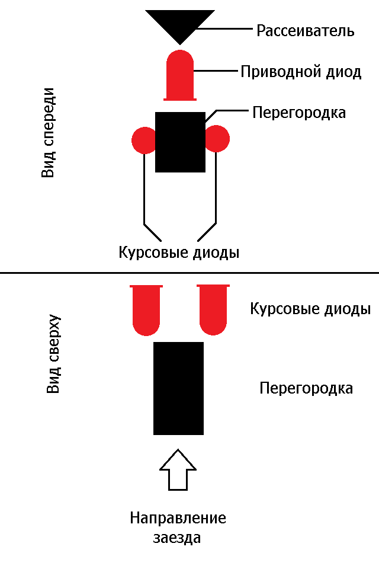

Как робот-пылесос ищет базу?
=============================

   
 2020-09-06, 23:59   
  Выбирая робот-пылесос я столкнулся с тем, что большинство статей на эту тему:   
 а) носят общий характер (смотрите -- снизу у робота пылесоса есть щёточки! они метут)   
 б) являются обзорами конкретных моделей (мы вчера купили -- смотрите, а вот тут у него щёточки!), при этом опыт эксплуатации, как правило, небольшой.   
   
 Мне же было интересно всё противоположное. А именно -- специфика работы с точки зрения инженера и опыт длительной эксплуатации.   
   
 Поскольку соответствующего контента мало, я решил создать его самостоятельно. Заодно узнаю, действительно информации нет (тогда мои заметки всплывут в поисковике), или они просто тонут среди миллиарда общих статей, повторяющих друг друга.   
   
 Сегодня я расскажу о том, как робот-пылесос ищет базу. Я не знаю, как это происходит в подробностях, но я увидел достаточно, чтобы сделать разумное предположение. Конкретную модель я пока называть не буду, поскольку это не имеет значения для описания технологии.   
   
 Началось всё с того, что я хотел в точности знать, где у робота расположены ИК-датчики. Спереди на бампере у него был красный экран, сквозь который ничего не было видно. Я стал думать, как бы его просветить. Я вспомнил два метода и применил оба:   
 1) у фотоаппаратов (в т.ч. у камер телефонов) как правило плохие ИК-фильтры, поэтому они видят ИК-излучение;   
 2) у меня была камера наблюдения D-Link с ИК-подсветкой и ночным зрением.   
   
 С камерой ночного зрения получилось всё очень и нтересно, т.к. экран бампера оказался полностью прозрачным для неё, и я смог в подробностях увидеть все кабеля и микросхемы внутри. Но просмотр фотоаппаратом оказался более информативным для моих целей, поскольку фотоаппарат видел сквозь экран плохо, но он видел главное -- светодиоды (понятно, что датчик это не светодиод, но он должен быть где-то рядом). А у камеры ночного зрения была ИК-подсветка и я долго разбирался, где настоящий свет светодиода, а где блик от подсветки. Потом я просветил обоими камерами базу. Тогда-то я и увидел, как она устроена.   
   
 Смотря, как робот наводится на базу, папа сказал -- "мне кажется, тут используются космические технологии типа Союз-Апполон". Я сказал, что скорее авиационные. Потому что уж больно было похоже на заход по  [ILS](https://en.wikipedia.org/wiki/Instrument_landing_system)  . У меня в голове сразу предстала чудовищная картина приводного маяка в базовой станции -- и приёмника в пылесосе, который узнаёт с точностью до градуса угол по направлению на базу. И! По-видимому примерно так всё и работает.   
   
 Итак, в базе находятся три (!) ИК-светодиода. Есть ещё четвёртый -- сигнал питания, но он не ИК. Забудем про него.   
   
 Первый светодиод светит вверх. Над ним расположен конический рассеиватель. Это -- приводная радиостанция)). По ней робот примерно понимает, с какой стороны находится база -- и заходит на неё не по прямой, а по диагонали. Причём заход идёт небольшими шажками, а не непрерывной ездой -- он сначала немного поворачивает, а потом немного проезжает. Далее цикл повторяется. На основании этого я делаю вывод, что приводной диод ищется одним из боковых ИК-датчиков (расположены под 90 градусов к оси прямого движения), причём датчик принимает сигнал только в узком диапазоне углов. С этим и связан метод езды. Когда робот немного проезжает, он теряет базу из вида. После этого он поворачивается и вновь её обнаруживает.   
   
 Ниже расположены два светодиода для точной наводки. Расположены они вот так:   
   
        
   
 Мне кажется, что дальнейшие комментарии излишни, но я всё-таки немного напишу. Это не совсем ILS, это  [PAPI/VASI](https://en.wikipedia.org/wiki/Precision_Approach_Path_Indicator)  .   
   
 Когда робот обнаруживает оба сигнала от курсовых диодов, он перестаёт ехать боком. Он разворачивается передом к диодам и дальше заезжает по прямой, немного подруливая влево или вправо.   
   
 Светодиоды моргают с разной частотой, таким образом по принятому сигналу можно понять, который из светодиодов виден. При разных углах обзора видны разные светодиоды, потому что перегородка их закрывает. Если робот видит только один светодиод, то он знает, что расположен от базовой станции с определённой стороны -- и знает, куда ему надо двигаться. Если он видит оба светодиода, то он расположен точно по нужному курсу. "Посадка" заканчивается, когда на контакты питания приходит напряжение. Определил я это следующим образом.   
   
 Я просветил базу со всех сторон и обнаружил, что курсовые светодиоды видны и сзади. В качестве эксперимента я развернул базу жопой от стены и попробовал запарковать робот на неё. Он доехал до базы точно, а потом продолжал пихать её, даже когда она упёрлась в стену.   
   
 По-видимому, необходимость грубого и точного наведения связаны с тем, что контакты для зарядки имеют довольно небольшую площадь (около 1 на 1 см). Вот у роботов от Xiaomi, например, контакты для зарядки просто огромные. Я подозреваю, что они обходятся только грубой системой.   
    
 <https://diary.ru/~zHz00/p219882523_kak-robot-pylesos-iwet-bazu.htm>   
   
 Теги:   
 [[Борьба с техникой]]   
 [[Статьи]]   
 ID: p219882523