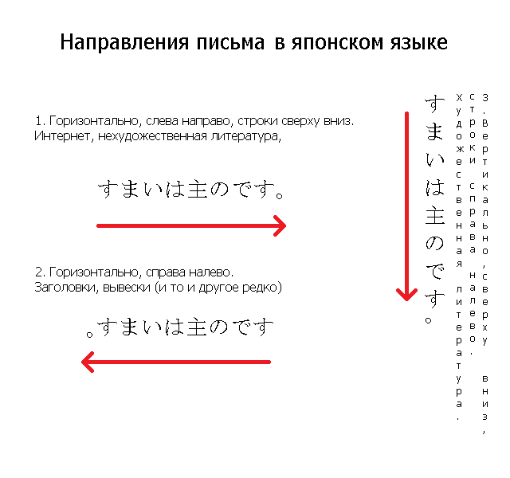
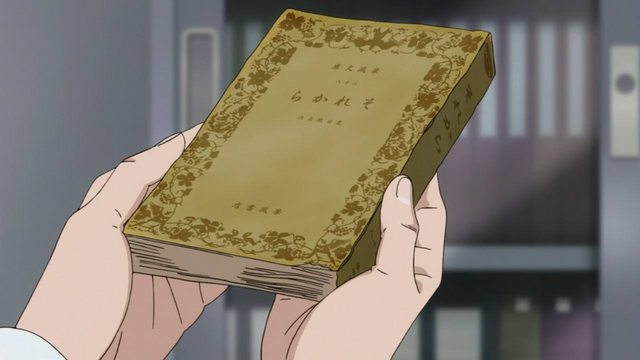

Направление письма в японском языке
===================================

  
2018-05-30, 23:59  
 Для прикола.   
   
      
 Живой пример пп. 2 и 3 одновременно (книга называется sore kara):   
   
       
 (koi wa ameagari no you ni, серия 10)    
  
<https://diary.ru/~zHz00/p215556771_napravlenie-pisma-v-yaponskom-yazyke.htm>  
  
Теги:  
[[Японский язык]]  
ID: p215556771  

(Комментариев нет)
------------------