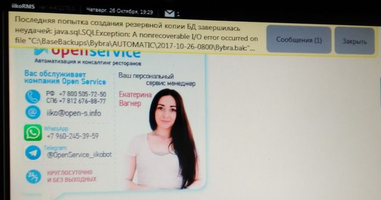

Об ошибках в POS-терминалах
============================

   
 2018-05-25, 23:59   
  POS-терминалы, банкоматы и другие подобные устройства стали весьма распространены. Очевидно, информация, которая на них показывается, чем-то генерируется. Как правило, в основе подобных устройств лежит обычный ПК, хотя иногда встречаются исключения.   
   
 Поскольку в основе -- ПК, а на нём крутится винда и какое-то ПО, всё это изредка падает. Выводятся соответствующие сообщения об ошибках, синие экраны и прочее.   
   
 И вот этот момент, когда служебный экран вместо основной функции начинает показывать винду или какое-нибудь неположенное окошко, вызывает ощущение разрыва реальности. Этого тут быть не должно! Как будто декорация отвалилась. И это и есть отвалившаяся декорация -- в прямом смысле!   
   
 Не я один дивлюсь на такое, в интернете куча фоток. Я сам тоже снимаю, если вижу. Вот, например, захожу я как-то раз в одно заведение и вижу там на кассе вот что:   
   
        
   
 Хотя испытать удивление в связи с нетипичной ситуацией -- это очень хорошо, но для владельцев экранов отвалившаяся декорация -- это плохо. Хотя все всё понимают, но демонстрация внутренностей всё равно снижает доверие к владельцам. Непорядок у них!   
   
 Как же должно вести себя ПО на компьютерах, экраны которых постоянно видят клиенты?   
   
 1. Желательно, чтобы сообщения об ошибках на такие экраны не выводились вообще. Должно быть просто написано "устройство временно не работает". Примерно так пишут банкоматы Сбербанка. Клиентам незачем знать, что там сломалось. Если устройство предназначено для пассивного вывода информации, либо работают с ним только сотрудники, но не клиенты, то можно вообще выводить логотип организации без пояснений. Тогда клиенты даже не догадаются, что что-то сломано. Очевидно, сотрудники должны уметь отличать логотип, сигнализирующий об ошибке, от обычного.   
 2. Естественно, работники, либо сервисный инженер, должны иметь возможность узнать, что произошло на самом деле. Это можно реализовать различными способами, к примеру, если нажать определённую комбинацию клавиш на терминале, откроется окно с текстом ошибки. Также возможна запись в лог-файл и последующий дистанционный его просмотр.   
 3. Тексты сообщений об ошибках должны быть на простом русском языке. Если работник в состоянии сам исправить ошибку, по тексту должно быть понятно, что делать ("отсутствует питание: вставьте вилку в розетку"). Если сообщение предназначено для сервисного инженера, оно должно легко читаться вслух, чтобы инженер мог оказать помощь по телефону. Проще всего выводить код ошибки.   
   
 Философский вопрос, следует ли перезапускать программу, если возникла ошибка? Или надо держать её в состоянии ошибки до прибытия помощи? Я считаю так: если ошибка предусмотрена разработчиками и корректно обработана И нет серьёзной необходимости, чтобы ПО постоянно работало, то пусть себе висит в состоянии ошибки. Если же ошибка не предусмотрена (типа access violation) либо если ПО должно работать 24/7, то лучше программу перезапустить. То есть:   
   
 4. Должна быть специальная сторожевая программа, которая проверяет, жива ли основная. Сторожевая программа должна уметь определять нестандартные ситуации (и особенно access violation) и при малейшем подозрении перезапускать основную программу. Основная программа, в свою очередь, должна проверять, жива ли сторожевая, и запускать её, если упала уже она.   
 5. Продолжение 4. Предусмотренные сообщения об ошибках должны выводиться в стиле основного интерфейса. Любые стандартные окошки винды, панель задач и т.п. -- недопустимы. Если основная программа падает всё время, сторожевая должна запускать альтернативную программу, которая будет уметь показывать на экране только полноэкранный логотип на переднем плане. Шанс, что такая программа сфейлится в работе, гораздо ниже, чем шанс фейла основной.   
   
 После этого останется только падение винды в синий экран (с этим ничего не сделаешь) и особо назойливые сообщения, которые по какой-то причине вылезают поверх полноэкранного приложения, которое расположено поверх всех окон. И клиенты будут довольны и не испуганы.   
    
 <https://diary.ru/~zHz00/p215525235_ob-oshibkah-v-pos-terminalah.htm>   
   
 Теги:   
 [[Программирование]]   
 [[Восприятие]]   
 [[Мысли]]   
 ID: p215525235