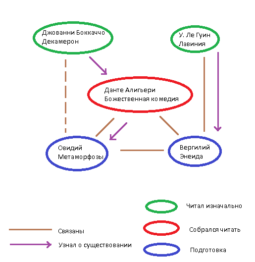
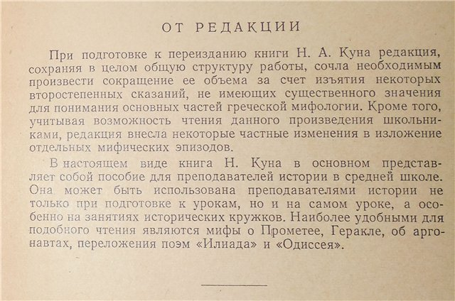

Овидий // Метаморфозы
======================

   
 2014-06-11, 23:32   
    *Там за углом продаются решётки стальные,   
 Их для дворца своего покупал шлемоблещущий Гектор.*     
 Сначала следует сделать пояснение, сфигали я решил ознакомиться с сим литературным памятником, которому только-только стукнуло два килогода. Сделаю я это в виде диаграммы:   
   
      
 Теперь про саму книгу. Что портило впечатление:   
 1) Гекзаметр. В начале было очень тяжело. Потом я понял, что он не абы как написан, а потом прочитал в интернете, как он устроен. Стало лучше.   
 2) Порядок свободный слов в языке русском. Переводчик Шевринский этим беззастенчиво пользуется. Это даёт, с учётом внезапных переносов строк по ритму, ситуации, в которых непонятно, какая часть предложения к чему относится. Прочитаешь 2-3 раза, вроде понял. А с первого раза -- далеко не всегда. Думал -- если читать вслух, всё будет понятно! Попробовал. Нифига. Вслух ещё хуже стало.   
 3) Бесконечное число синонимов имён для одних и тех же персонажей. Геркулес? Алкид. Это самый распространённый случай, поэтому я его запомнил.   
   
 Эта книга -- сборник историй про древнегреческих/древнеримских богов и некоторых людей. Истории рассказаны офигительные. Многие сюжеты строятся по следующему шаблону:   
  *Один бог заметил красивую девицу и захотел с ней переспать, он побежал за ней, а она от него. Он её догнал и изнасиловал. После (до, во время) изнасилования она превратилась в птичку (рыбку, дерево).*    
   
 От этого истории не менее офигительны, кроме того, есть и иные. Об'единяет их все то, что они связаны с превращениями одних в других и то, что они основаны на греко-римском пантеоне богов. После прочтения я стал немного в нём разбираться. Чуть-чуть.   
   
 Единого сюжета нет, связки между историями обычно выглядят приблизительно следующим образом:   
  *Вот я рассказал историю этого паренька. Кстати, на другом конце мира был совсем другой паренёк, но такого же возраста. О нём и поговорим.*    
   
 Есть, правда, последовательные истории, а также рамочные конструкции, даже такие:   
  [(развернуть, спойлеры!)](https://zHz00.diary.ru/p198081365.htm?index=1#linkmore198081365m1)      
 
```
Cначала у Орфея умерла жена и он пошёл за ней в Аид.  
Ему там сказали -- бери, но НЕ ОБОРАЧИВАЙСЯ. Он обернулся и жена пропала.  
Он опечаленный сел на полянку и начал петь песню, о том,  
ЧТО:  
	{  
		1), 2), 3) -- пропускаю  
		4) Одна дочь страстно возжелала своего отца и с помощью няньки тайно переспала с ним.  
		Он хотел её убить, но было темно и он промазал. Она сбежала. Потом родила сына.  
		5) Этого сына полюбила богиня Венера и сказала ему, ходя с ним на охоту, чтобы тот не охотился на хищников  
		и она сейчас расскажет, почему. Пойдём в тенёк, приляжем вместе. Они прикладываются и она рассказывает о том,  
		ЧТО:  
			{  
				Жила была офигенная девица Аталантита. Она бегала быстрее мужиков.  
				Ей предрекли: бегай от них и не выходи замуж. Поэтому она поставила условие --  
				кто в беге её догонит -- получит её. а кто нет -- секир башка. И вот один мужик  
				собрался было побежать за ней, а она в него влюбилась. А он попросил помощи у Венеры (см. выше).  
				Венера дала ему золотые яблоки. Он бежит за девицей и яблоки кидает.  
				Девица отвлекается на них и пока подбирает -- отстаёт. Короче, он её обогнал и получил.  
				Но благодарности Венере не вознёс. Венера обиделась и сделала так, что они возжелали  
				друг друга проходя мимо древнего храма, где и уединились. А боги этого храма на них  
				тоже обиделись и превратили во львов. Злыми они стали после этого.  
				Поэтому на хищников охотиться нельзя.  
			}  
		Но тот паренёк её не послушал и его заколол дикий вепрь прямо в пах. А Венера превратила его трупик в цветок.  
	}  

```
     
   
 Книга хорошая, рекомендую читать тем, кто хочет знать мифы Древней Греции, но испытывает недоверие к Н.А. Куну. А если испытываете, то не зря. Вот комментарий к изданию 1959 года:   
   
   [](http://radikal.ru/fp/e3599aba8f43441c9cc77175ce9f753f)     
 Т.е. -- всё зацензурено. Можно подумать, что в новых изданиях цензура будет убрана, но книжка была изначально школьная. Да, кроме Метаморфоз, при пересказе Куном использованы Илиада и Одиссея Гомера (не Симпсона) и Теогония Гесиода. До них я не добрался и не знаю, доберусь ли.   
   
 Далее по "книгам" (главам), отмечу наиболее эпичные моменты:   
  [(по книгам)](https://zHz00.diary.ru/p198081365.htm?index=2#linkmore198081365m2)      
  **Книга 1:**  Девкалион и Пирра: АААА! Когда я читал Ветхий Завет, я всё не мог найти сцены с киданием камней за спину. А вот она! Т.е. легенда о потопе наличествует и в Ветхом Завете и в греко-римской мифологии. Забавно. Вот, кстати, совет им, данный богами, о том, как делать детей:   
  *"...Выходите из храма;   
 Головы ваши покрыв, одежд пояса развяжите   
 И через плечи назад мечите праматери кости".*    
 Они сомневались, правильно ли толкуют предсказание, но стали кидать камни. А я думаю -- может это им был намёк, что надо было сексом заняться?   
  **Книга 2:**  Фаэтон: ох, как я за него переживал, а потом перелистнул страницу и сам себе соспойлил.   
  **Книга 3:**  Тиресий. Сама его история довольно забавная -- с переменой пола, но суд, на который его вызвали судьёй -- и итог суда -- ещё забавнее. Вакх; тирренские пираты -- я боюсь Вакха. Что Вакх -- алкогольный Дионис, я узнал позднее.   
  **Книга 4:**  Пирам и Фисба: ААА! Это же Ромео и Джульетта! Даже я, не читавший, узнал.   
 Учительница: "Шекспир, Овидий -- кто из вас у кого списал?!"   
 Овидий: "Я раньше работу сдал!"   
 Шекспир: "Не, а чего я сразу?!"   
  **Книга 5:**  Персей и женихи: эпичным способом пересказывается бытовая поножовщина на свадьбе. Причём очень подробно, в стиле Кино но таби. Очень радует такой пересказ. Прикол с головой Медузы Горгоны не может не напомнить игру NetHack -- там окаменение сильно помогает в ряде случаев.   
  **Книга 6:**  Прокна и Филомела: ААА! Охренительно! Вот она, "мстя будет страшна"!   
  **Книга 7:**  Книга посвящена, в основном, Медее. Её историю я так и не понял. Точнее, её мотивацию.   
  **Книга 8:**  Калидонская охота: история о том, как эпичная охота с эпичной победой закончилась поножовщиной между охотниками из-за того, что среди них была женщина, которой одни хотели дать долю в добыче, а другие нет (нонакрийская дева).   
  **Книга 9:**  Эта книга офигительна целиком. Не хотите читать все "Метаморфозы", прочитайте тогда хотя бы девятую книгу!   
  **Книга 10:**  Пигмалион: ну вот, теперь я знаю эту историю не только в пересказе из Ever17.   
  **Книга 11:**  Гибель Орфея; фракийские вакханки -- О\_о. Ну и история. За что они на него обиделись-то? Завидовали таланту?   
  **Книга 12:**  Кентавры и лапифы -- ещё одна поножовщина на свадьбе, и снова радует!   
  **Книга 13:**  Гекуба: ещё одна офигительная история мести. Говорят, понятие любви в романтическом смысле (современное) появилось лишь в средние века -- возможно. Но уж жажда мести была уже тогда. ААА!   
  **Книга 14:**  Скилла (Сцилла): ААА! Собаки, растущие вокруг влагалища! Цирцея злая. Видно, что женщин мало уважали в те времена, но женщины и без уважения кое-что могли сделать (если смотреть по всему тексту, то всякие мести и козни принадлежат, в основном, им).   
  **Книга 15:**  Эпик фейл. Самая плохая книга. Единственная немного заслуживающая внимания история -- Эскулапа. Как его на корабле везли -- это сильно. Но первая половина книги -- изложение взглядов "Пифагора" -- о вегетарианстве и не только. И про четыре стихии. Замыкание круга стихий выглядит странно. Земля -- Вода -- Воздух -- Огонь, а дальше возврат в Воздух, а не сразу в Землю. То есть, цикла нет. В конце книги раглагольствования о том, что император Август превзошёл своего отца -- Гая Юлия Цезаря (хотя сейчас, спустя 20 веков, понятно, что не превзошёл -- Гай Юлий Цезарь сейчас нарицательное имя, а Август -- нет; оба они названия месяцев). Короче говоря, книга выглядит, как политический заказ. Хотя убеждения Пифагора -- если бы они завершали книгу, а не начинали её -- хорошо подводили бы черту под темой "Метаморфоз" -- "Превращений" всего и вся. Кстати, несмотря на комплимент (не буду грубее писать) Овидия в сторону Августа, Август его всё равно сослал на остров Понт.     
   
  [(по изданию)](https://zHz00.diary.ru/p198081365.htm?index=3#linkmore198081365m3)      
 По изданию. Читал издание  [Азбука-Классика 2014 года](http://www.labirint.ru/books/151136/)  , т.к. кроме него в продаже было лишь подарочное за 6 килорублей. Это издание не для полки, а для одного прочтения. Из недостатков:   
 а) шрифт; он зауженный, что вызывает неприятное ощущение при взгляде -- хотя читать оказалось удобнее, чем я ожидал, когда первый раз его увидел.   
 б) две опечатки (:   
 в) бедный справочный аппарат -- только примечания Ф. Петровского (такое ощущение, что сокращённые). В тексте нет пометок о начале следующего эпизода, если он начинается с той же строки (если с новой -- стоит отступ), нет его названия (только в содержании) -- но это мелочи, т.к. ни в одном издании этого нет, хотя не помешало бы. Что важнее -- отсутствует список персонажей и граф их взаимоотношений, а также список синонимов имён. Нечто подобное есть в издании 1977 года -- но его мне достать пока не удалось.     
    
 <https://diary.ru/~zHz00/p198081365_ovidij-metamorfozy.htm>   
   
 Теги:   
 [[Книги]]   
 ID: p198081365