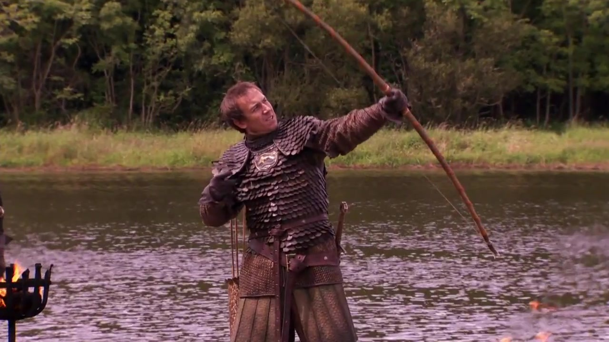
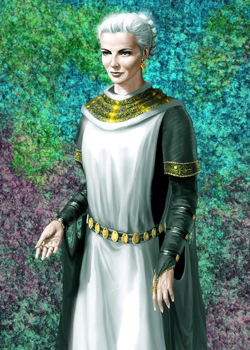

Одна стена -- огонь, другая -- лёд
==================================

  
2015-04-22, 23:56  
 В начале был цикл вайл:   
   
 n=n0;   
 while(cond)   
 {   
 //... что-то с участием array[n]   
 n--;   
 }   
   
 Потом планы изменились, и я переделал это в цикл фор:   
   
 for(n=0;n<n0;n++)   
 {   
 // то же самое   
 }   
   
 Потом думаю -- что-то цикл бесконечным стал.   
   
 ОКАЗАЛОСЬ   
   
 я забыл убрать n--;   
   
 Так он и принимал значения -- то 0, то -1.   
  
<https://diary.ru/~zHz00/p203839949_odna-stena-ogon-drugaya-lyod.htm>  
  
Теги:  
[[Программирование]]  
[[Говнокод]]  
ID: p203839949  

Комментарии: 13
---------------

  

---

|         #         |              Дата              |                     Автор                     |           ID           |
| --- | --- | --- | --- |
| (1/13) | 2015-04-23, 02:02 | Гость | c687846332 |

  
 Огонь и лёд, говоришь...   
   
 Ну, ладно! Спамим zHz картинками из саги "Песнь Льда и Огня"!   
   
 Ours is the fury!   
 ^c687846332

---

|         #         |              Дата              |                     Автор                     |           ID           |
| --- | --- | --- | --- |
| (2/13) | 2015-04-23, 02:03 | Гость | c687846357 |

  
    
 ^c687846357

---

|         #         |              Дата              |                     Автор                     |           ID           |
| --- | --- | --- | --- |
| (3/13) | 2015-04-23, 02:06 | Гость | c687846397 |

  
    
 ^c687846397

---

|         #         |              Дата              |                     Автор                     |           ID           |
| --- | --- | --- | --- |
| (4/13) | 2015-04-23, 02:08 | Гость | c687846422 |

  
    
 ^c687846422

---

|         #         |              Дата              |                     Автор                     |           ID           |
| --- | --- | --- | --- |
| (5/13) | 2015-04-23, 02:10 | Гость | c687846450 |

  
    
 ^c687846450

---

|         #         |              Дата              |                     Автор                     |           ID           |
| --- | --- | --- | --- |
| (6/13) | 2015-04-23, 02:12 | Гость | c687846478 |

  
    
 ^c687846478

---

|         #         |              Дата              |                     Автор                     |           ID           |
| --- | --- | --- | --- |
| (7/13) | 2015-04-23, 02:15 | Гость | c687846523 |

  
    
 ^c687846523

---

|         #         |              Дата              |                     Автор                     |           ID           |
| --- | --- | --- | --- |
| (8/13) | 2015-04-23, 02:16 | Гость | c687846544 |

  
    
 ^c687846544

---

|         #         |              Дата              |                     Автор                     |           ID           |
| --- | --- | --- | --- |
| (9/13) | 2015-04-23, 02:18 | Гость | c687846571 |

  
    
 ^c687846571

---

|         #         |              Дата              |                     Автор                     |           ID           |
| --- | --- | --- | --- |
| (10/13) | 2015-04-23, 05:29 | Гость | c687847921 |

  
    
 ^c687847921

---

|         #         |              Дата              |                     Автор                     |           ID           |
| --- | --- | --- | --- |
| (11/13) | 2015-04-23, 05:34 | Гость | c687847941 |

  
 На картинке выше - Эйгон Завоеватель, покоривший Семь Королевств, первый король Вестероса из династии Таргариенов, а также две его сестры - Висенья и Рэйнис.   
   
 Примечателен тем, что был женат на обеих сёстрах.   
   
 Древняя и мудрая цивилизация Валирии не видела ничего плохого в браке с родной сестрой.   
 ^c687847941

---

|         #         |              Дата              |                     Автор                     |           ID           |
| --- | --- | --- | --- |
| (12/13) | 2015-04-23, 05:36 | Гость | c687847952 |

  
    
 ^c687847952

---

|         #         |              Дата              |                     Автор                     |           ID           |
| --- | --- | --- | --- |
| (13/13) | 2015-04-23, 05:41 | Гость | c687847983 |

  
 А на картинке выше - добрая королева Алисанна Таргариен. Жена своего брата Джейхейриса. Жили долго и счастливо, правили мудро.   
   
 А если бы Джейхерис женился на неродной, то, возможно не получилось бы такой счастливой семьи. Глупые предрассудки насчёт браков с родными сёстрами...   
 ^c687847983