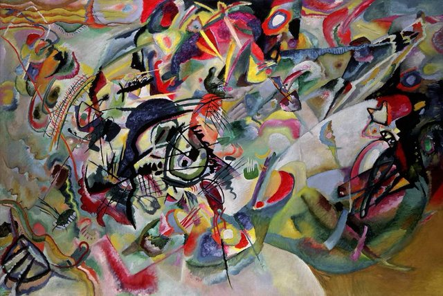

Паззл с Кандинским (500)
=========================

   
 2017-03-31, 23:59   
  Сборка паззлов -- бессмысленное времяпрепровождение. Я это заявляю уверенно, поскольку собирал паззлы до 2000 половинок.   
   
 Но за последние несколько лет я не собрал ни одного. Недавно мне в руки попал паззл фирмы Московская мозаика с картиной Кандинского "Композиция VII". И было в нём всего-навсего 500 половинок. Вот как эта шнягя выглядит:   
   
        
 Я решил, что собирать просто так будет неинтересно. Поэтому я отложил в сторону коробку, на которой было готовое изображение, и стал собирать так.   
   
 Кандинский -- художник-абстракционист. Он рисует фигню. Просто так смотря на картину не только ничего не поймёшь, но и ничего не почувствуешь. А при сборке паззла, как раз, вступаешь в тесное взаимодействие с изображением. Короче говоря, ощущения от сборки у меня были необычными. До этого я никогда не собирал картины и, тем более, абстрактные картины. И таких ощущений тоже никогда не испытывал.   
   
 Мне кажется, познание творчества Кандинского возможно именно через паззлы с его картинами. Что же я познал?   
   
 Во-первых, непредсказуемость. Очень много деталей я не мог обнаружить (и не раз смотрел под стол -- не упала ли нужная?). Потому что даже зная, как выглядят края детали со всех сторон, не всегда удавалось правильно угадать, как она выглядит в целом. Обязательно линия, до этого шедшая прямо, делала изгиб. Обязательно цвет немного менялся. В итоге я много раз смотрел на нужную деталь, но не видел её. Потом находил и думал -- ах, так вот как оно было, оказывается, на самом деле!   
   
 Во-вторых, работа с цветом. Сортировка деталей по цвету -- стандартная методика сборки. Разглядывая детальки, видишь -- что тут имеет значение не только сам цвет, но и его фактура, а конкретнее -- способ нанесения краски. В способах я не разбираюсь, но видно, где он одинаковый, а где он разный. Это вносит дополнительное измерение в процесс сортировки. Детали же, имеющие части с одинаковым цветом, чаще всего расположены рядом, поскольку оттенки почти не повторяются. Это приводит к созданию "центров кристаллизации": у меня появилось несколько участков картины, которые я уже собрал (из 2-10 деталек). Но я пока не знал, куда их пихать. И даже не знал, какой стороной это надо будет делать. Кроме того, любопытно было наблюдать плавное перетекание одного оттенка в другой.   
   
 В-третьих, линии. Именно линии при сборке являлись основным связующим звеном частей картины. Они позволяли об'единять различные "центры кристаллизации" друг с другом, а также собирать сами эти центры. И связь по линиям гораздо крепче, чем связь по цветам (хотя линии тоже имеют какой-то цвет, но не всякий цвет образует линию).   
   
 Всё это касается локального восприятия картины. Глобального восприятия при помощи сборки, мне кажется, не добиться. Надо созерцать.   
   
 К сожалению, большинство других паззлов с Кандинским (которых довольно мало в продаже) имеют уклон в супрематизм, так что их сборка, по-видимому, менее интересна.   
   
 Напоследок пишу о качестве паззла:   
  [(о качестве)](https://zHz00.diary.ru/p212402257.htm?index=1#linkmore212402257m1)      
 Коротко -- качество отвратительное.   
 1. Изготовитель зарезал 5-10% картины с обоих сторон. Но слева -- гораздо больше! Три похожие волны на бледном фоне вообще не попали! Понятно, что она была не по формату. Однако зарезать -- это довольно плохо, т.к. часть картины не попадает. И нельзя сказать, что это менее важная часть, чем остальные. Не знаю, какое тут решение было бы лучше. Ужать изображение? Обрезать симметрично?   
 2. Все детали имеют стандартную форму -- два шипа напротив друг друга и два паза. Формы шипов и пазов почти не отличаются. Из-за этого некоторые детали довольно хорошо подходят не на своё место. А учитывая абстрактный характер изображения, ориентироваться на него при установке детали не всегда возможно. Также невозможно производить сортировку деталей по форме (в т.ч. по форме шипов-пазов).   
 3. Кто-то писал, что у Castorland плохая сцепка деталей. Отличная у них сцепка. Писавшие просто не видели данной продукции. ВОТ ЗДЕСЬ действительно плохая сцепка. Я даже две детали за раз перенести не могу -- отваливаются. Щели между деталями огромные -- это тоже, как и п. 2, увеличивает шанс установки детали не на своё место. При сборке паззл гуляет туда-сюда.   
   
 Но есть кое-что хорошее. Это коробка. Такой качественной коробки для паззлов я не видел никогда. Сделано на века.   
   
 Короче говоря, рекомендовать приобретение паззлов данной фирмы я могу только тем, кто хочет обязательно собрать какую-либо картину, которой нет у других фирм. Дело в том, что фирма специализируется именно на паззлах с картинами. Поставляет свою продукцию в музеи, где эти картины выставлены. Там их и продают. Дополнительный минус -- 500 деталек это максимум для данной фирмы.   
     
    
 <https://diary.ru/~zHz00/p212402257_pazzl-s-kandinskim-500.htm>   
   
 Теги:   
 [[Восприятие]]   
 [[Мысли]]   
 ID: p212402257