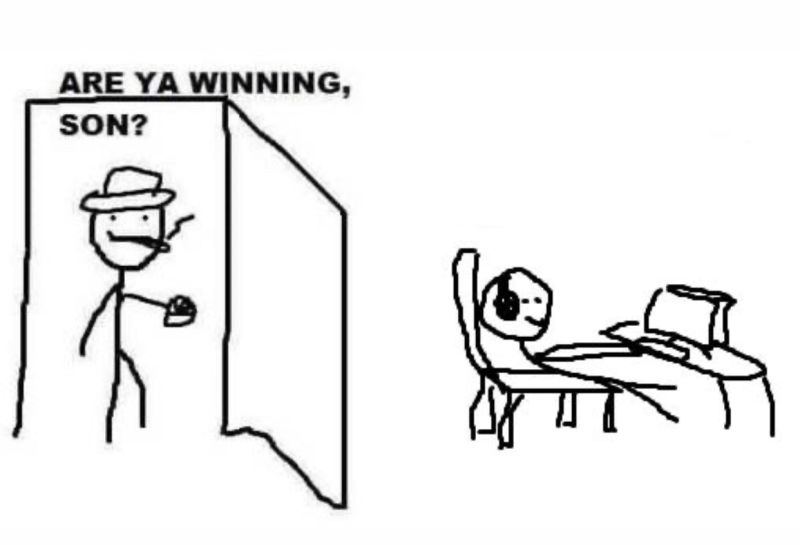
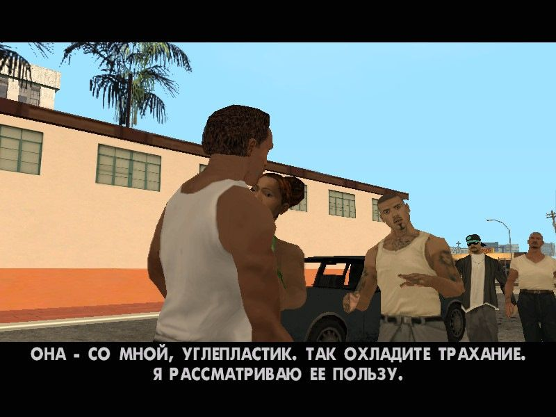
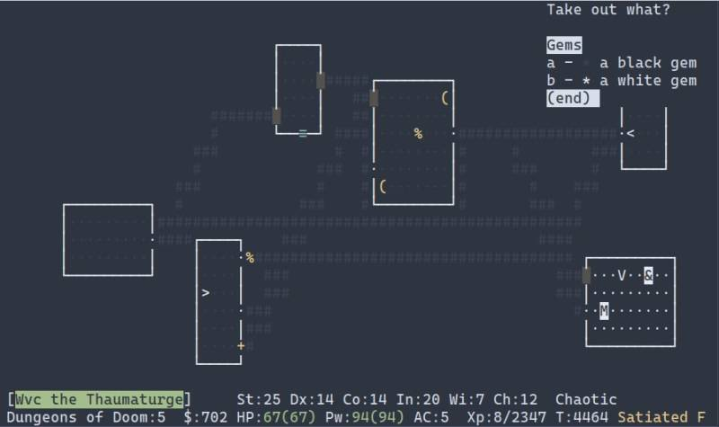
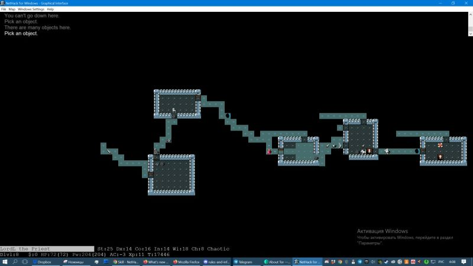
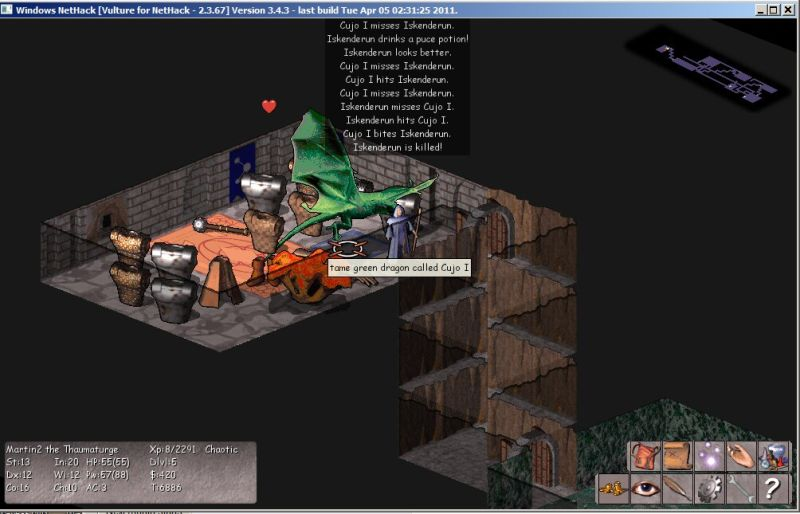
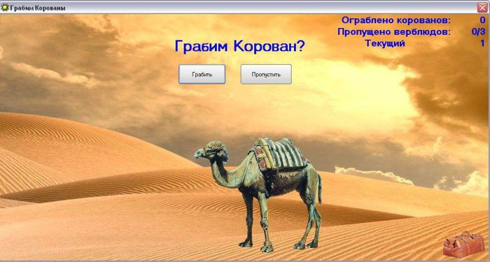

Платиновые вопросы про NetHack
==============================

  
2022-10-26, 00:50  
 Снова я решил написать заметку для новичков, а точнее -- даже для тех, кто в NetHack никогда не играл, а только кое-что слышал. Я не буду писать про то, как играть. Об этом уже и так порядочно написано. Я хочу коснуться ряда общих вопросов, которые часто возникают у только начавших или даже не начавших игроков.   
   
  **Q: Каким образом при помощи NetHack можно взламывать сети? Это сканер портов? Или это сниффер? А может быть NetHack -- это руткит?**    
   
        
  [(читать дальше)](https://zHz00.diary.ru/p221375799.htm?index=1#linkmore221375799m1)     **A:**  NetHack не предназначен для взлома компьютерных сетей. NetHack -- это компьютерная игра! Это компьютерная ролевая игра. Пошаговая, для одного человека.   
   
 Почему же она тогда так называется? Официальные разработчики сообщают следующее:   
   
  *"Net" обозначает, что разработчики во время работы над игрой общаются друг с другом по сети. Многие из них никогда не виделись друг с другом.*    
   
  *(The "Net" in NetHack refers to the way the developers, many of whom have never met in person, organize the work on the program. )*    
   
 Что касается Hack, то была  [игра](https://en.wikipedia.org/wiki/Hack_%28video_game%29)  с таким названием. Это один из предков NetHack. Слово Hack в данном случае обозначает не взлом компьютеров, и даже не программирование. Hack здесь переводится как "разрубать на куски" (монстров), чем и занимается игрок большую часть игрового времени.   
   
 Отдельно хочу обратить внимание на то, что сюжет и сеттинг NetHack также не имеет отношения ни к сетям, ни к взлому. Это не киберпанк. NetHack -- "классическая" фэнтезийная игра с эльфами, файерболлами и кольцами всевластья.   
   
  **Q: Играю в Pathos Nethack Codex. Это же нетхак! Почему нетхакеры шлют меня нахуй?**    
   
        
  **A:**  Патос -- не плохая игра. Но это не NetHack. Что же это? Автор Патоса взял основные механики, наборы предметов и монстров из оригинального нетхака и сделал с ними свою игру, назвав её Pathos Nethack Codex. Игра получилась упрощённой, но довольно удобной и симпатичной. Почему же к ней так плохо относятся?   
   
 Потому что плохо относятся не к ней, а к игрокам, которые в неё играют.   
   
 Дело в том, что Патос изначально делался под смартфоны, а кроме того, с самого начала допускал возможность перевода на другие языки. И русский язык есть. Мобильные платформы + русский язык = огромное количество случайных игроков. Они пока ещё понятия не имеют о том, что такое  [рогалики](https://ru.wikipedia.org/wiki/Roguelike)  . Английский язык не стоит перед ними культурным и интеллектуальным барьером. Это приводит к ситуациям, когда в чаты заходят невежливые, высокомерные люди, которые с ПАФОСНЫМ выражением задают вопросы в духе "ну чо, почём тут рыбу продают? а это чо? а это?"   
   
 Русскоязычное сообщество (  [t.me/runethack](https://t.me/runethack)  ) довольно камерное, поэтому после нескольких таких заходов все становятся очень нервными. Игрок спрашивает что-то про Пафос? Это уже наполовину красный флаг.   
   
 Будьте вежливыми и скромными -- и к вам будут нормально относиться. Хотя на вопросы по Патосу в основном чате мы всё равно не отвечаем, потому что основной чат посвящён исключительно классическому NetHack. Для обсуждения других рогаликов у нас есть отдельный оффтоп-чат,  [t.me/DnDnOther](https://t.me/DnDnOther)  .   
   
  **Q: Я не понимаю, что означает буковка на экране, в инвентаре и т.п.**    
  **Q: Я нашёл, что означает буковка! Это была statue of a grid bug! И что это?**    
   
      
  **A:**  NetHack -- рогалик, поэтому для игры в него надо очень много знать, а то, чего вы не знаете, надо уметь искать. Вы можете задавать вопросы в сообщество, однако вопросы начального уровня очень быстро перестают возбуждать других игроков. Вы должны с самого начала учиться разбираться во всём самостоятельно.   
   
 Итак, прежде, чем задать свой первый вопрос в сообщество, подумайте, прочитали ли вы официальное 50-страничное Руководство? Если нет -- то прочитайте разделы 1-7. Ответы на многие вопросы вы найдёте там.   
   
 Вот оно (на русском языке):  [nethack-rutext.info/doku.php/wiki/guidebook#vst...](https://nethack-rutext.info/doku.php/wiki/guidebook#vstuplenie)    
 Систематизированная информация есть в энциклопедии NetHackWiki (на английском языке),  [nethackwiki.com/wiki/Main\_Page](https://nethackwiki.com/wiki/Main_Page)    
   
 Отправлять новичка сразу читать руководство может показаться жестоким, но именно такова суровая реальность нетхака: информация из Руководства жизненно необходима для игры. Вам всё равно придётся её откуда-то узнать, так что лучше узнать её всю целиком оттуда, где она есть, а не собирать по кусочкам из ответов других игроков, статей NetHackWiki и реддита.   
   
 Но ладно, давайте всё-таки вернёмся к изначальному вопросу, как узнать что значит буковка на экране?   
   
 Есть команда -- ;. Вы должны нажать точку с запятой на клавиатуре (это одна кнопка, а не две). После этого стрелочками можно подвести курсор к непонятному объекту, монстру и т.п. Далее надо нажать точку (и это тоже одна кнопка). В верхней строке вы увидите, как называется то, на что вы навели курсор. Можно забить это название в NetHackWiki и прочитать подробнее о том, что вы нашли.   
   
 Тем не менее, такие действия не всегда могут приводить к полезным результатам. Рассмотрим два типичных случая, которые могут сбить с толку начинающего игрока.   
   
  *Пример 1.*  statue of a grid bug. Попытки поиска ни к чему не приводят, энциклопедия не содержит такой статьи. В этом случае попробуйте поискать части названия. Например, статья Statue очень даже есть. И в этой статье указано, что статуи обязательно имеют указанный тип монстра, к которому они относятся. Т.е. statue of a grid bug это просто статуя решёточного жука. Искать информацию о ней надо в статье Statue. Если статуя оживёт (или вы её оживите), то искать информацию надо будет в статье Grid bug.   
   
  *Пример 2.*  emerald ring. Если попытаться найти это кольцо в энциклопедии, то вы увидите только полный список колец, но не поймёте, которое из них что делает. Если вас это смущает, то вы не поняли концепцию "случайный внешний вид вещей" (randomized appearance). Это одна из ключевых концепций в NetHack. Если коротко, в каждой игре emerald ring делает разные вещи. Вы должны явно или косвенно идентифицировать, что за кольцо у вас на руках. Энциклопедия в данном случае вам поможет лишь частично. Опыт и смекалка могут решить проблему.   
   
  **Q: Есть ли перевод игры на русский?   
 Q: Когда выйдет перевод игры на русский?   
 Q: А давайте сделаем перевод игры на русский!**    
   
        
  **A:**  Ответов тут может быть несколько.   
   
 1. Вы хотите перевод игры или русскоязычные статьи и энциклопедию? Если вы именно про игру, то читайте следующий пункт. Если вас интересуют статьи и подобное, то у нас есть сайт,  [nethack-rutext.info/](https://nethack-rutext.info/)  . В первую очередь рекомендую прочитать:   
 Руководство:  [nethack-rutext.info/doku.php/wiki/guidebook#vst...](https://nethack-rutext.info/doku.php/wiki/guidebook#vstuplenie)    
 Раздел для начинающих:  [nethack-rutext.info/doku.php/wiki/begin](https://nethack-rutext.info/doku.php/wiki/begin)    
   
 2. Перевод на русский язык есть, но автор перевода не публикует его. Посмотреть на геймплей можно здесь:  [www.youtube.com/watch?v=79JdKYlJnpo&list=PL9nk-...](https://www.youtube.com/watch?v=79JdKYlJnpo&list=PL9nk-9Al2pPzh-mGxWh16CjEhFhbivaZg)    
   
 3. Есть несколько частичных переводов на русский, но ни один из проектов сейчас не активен. В ближайшее время ожидать полного перевода на русский не следует.   
   
 NetHack написан очень давно, когда никто не задумывался о переводах. Игра написана так, что хотя сделать перевод и возможно, но это очень объёмная задача. Можно довольно легко сделать перевод меню, названий предметов и некоторых встроенных текстов. Сделать же качественный перевод, то есть такой, чтобы все фразы хорошо читались и были составлены грамматически правильно -- очень и очень сложно.   
   
 Подробнее о том, в чём заключается проблема, и о том, как дела шли у частичного проекта, можно прочитать тут:   
   
  [ru-nethack.livejournal.com/81176.html](https://ru-nethack.livejournal.com/81176.html)    
  [ru-nethack.livejournal.com/81712.html](https://ru-nethack.livejournal.com/81712.html)    
  [ru-nethack.livejournal.com/87544.html](https://ru-nethack.livejournal.com/87544.html)    
   
 Также прочтите комментарии к этим записям.   
   
 4. А давайте! Вы прочитали всё, что было по ссылкам выше? Вы готовы организовать  *систему*  , позволяющую делать грамматически правильные предложения со склонением названий всех предметов? Вы уже представляете, как будете это делать? Что ж, тогда я в деле. Я буду младшим помощником и чернорабочим -- если вы возьмётесь делать полноценный перевод.   
   
 Видите ли в чём дело, попытка перевода уже была, и не одна. Все переводчики берутся в первую очередь переводить то, что легко, то есть -- готовые предложения внутри текста. Но этот подход ошибочен, потому что он упирается в тупик. Важнее создать саму возможность полноценного перевода. Сейчас этой возможности нет. А конкретные люди, которые переведут конкретные строчки -- найдутся.   
   
  **Q: Есть ли нормальная графика у игры? Или так и придётся вглядываться в картиночки 16 на 16 пикселей? Или придётся учить буквы?**    
   
  **A:**  "Графика" у NetHack существует нескольких типов.   
   
 I. Почти все игроки-ветераны играют в "буквенный" вариант, который называется "игра в ASCII" ("ASCII-графика"). Это выглядит вот так:   
   
        
 Такой вариант имеет следующие преимущества:   
 1. Буквы и цвета букв стандартизованы. В какую бы версию и на какой платформе бы не играли, "читаться" экран будет одинаково.   
 2. Поскольку графика отсутствует, у игроков включается воображение, благодаря которому они могут сами представлять себе игровую ситуацию.   
 3. Благодаря схематичности восприятие и анализ игровых ситуаций также упрощается. Подобно тому, как видя положение стрелок на стрелочных часах, вы сразу знаете, сколько времени, так и в игре, видя россыпь букв, вы сразу понимаете, что происходит.   
 4. Можно выбрать любой размер и тип шрифта -- и игра всё равно будет прилично выглядеть. Это актуально для очень больших и очень маленьких мониторов. На очень больших стандартный шрифт может быть слишком мелким, а на маленьких игровое поле может не помещаться на экран.   
   
 Тем не менее, у игры есть несколько графических версий.   
   
 II. Игра, при которой буквы заменяются на квадратные картинки, на каждой из которых нарисован монстр, предмет, или какой-либо элемент окружения, называется "игра с тайлами" (tile). Тайлы -- это как раз квадратные картинки, из которых состоит игровое поле. В комплект поставки игры входит так называемый "тайлсет" (tileset), с которым игра выглядит вот так:   
   
        
 Это стандартная возможность, и почти все версии игры могут быть переведены в такой графический режим. Не всем, однако, он по душе. На современных компьютерах с экранами FullHD такое игровое поле становится слишком мелким. В этом случае вам могут помочь альтернативные тайлсеты. Для FullHD мониторов я рекомендую тайлсеты минимум 32x32 пикселя (стандартный -- 16x16). Если вы играете на смартфоне, то несколько тайлсетов уже имеются в вашем распоряжении. Если вы играете на компьютере, то тайлсеты придётся установить самому. Подробнее об этом можно прочесть здесь:   
   
  [nethackwiki.com/wiki/Tileset](https://nethackwiki.com/wiki/Tileset)  (на английском языке)   
   
 Если коротко: большинство альтернативных тайлсетов существуют только для версии 3.4.3. Сейчас эта версия считается устаревшей. Если вы играете в более новую, то выбор у вас будет более ограничен.   
   
 III. Игра с тайлами -- не самый крутой вариант. Есть игра в изометрии, подобной Fallout 2 (хоть и без анимации). У такого варианта графики только один "тайлсет", плюс надо ставить специальную версию игры. Раньше эта версия называлась Falcon's Eye, сейчас она называется Vulture's Eye. Falcon's Eye был бесплатным, но проект бросили. Vulture's Eye (а ныне просто -- Vulture) сделан на его базе и является платным. Вот так выглядит интерфейс данной версии:   
   
        
 Игра доступна на Стиме:  [store.steampowered.com/app/341390/Vulture\_for\_N...](https://store.steampowered.com/app/341390/Vulture_for_NetHack/)    
   
 IV. Но и это ещё не всё. Существуют "настоящие" трёхмерные версии NetHack, в том числе с видом от первого лица. Одна из них, NetHack 3D, продолжает находиться в активной разработке. Немногие смогут в неё поиграть, поскольку она доступна только под Mac OS X. Тем не менее, вот репозиторий в гитхабе:   
   
  [github.com/MaddTheSane/nh3d\_OSX](https://github.com/MaddTheSane/nh3d_OSX)    
   
 А вот как это выглядит:   
   
        
 Резюмируя всё, что я написал выше: современной графики в NetHack нету. И не будет. Почему? NetHack схематичен по своей природе. Вполне возможно сделать графику, анимацию, звук на современном уровне, но в этом нету смысла. Красивая графика будет только отвлекать и мешать концентрироваться на главном.   
   
  **Q: Есть ли в NetHack мультиплеер? А когда будет?**    
   
        
  **A:**  Вопрос очень больной. Мы не знаем, почему игроки хотят видеть мультиплеер, но этот вопрос возникает постоянно.   
   
 NetHack -- пошаговая игра. Поэтому любой мультиплеер предусматривает, что игроки ходят по очереди. После каждого своего хода вам надо будет дождаться, пока сходят все остальные игроки. Каждый ход. Когда вы играете сами, вы можете тратить на один ход как одну секунду, так и несколько минут. Все остальные монстры ходят "мгновенно". Если вы будете играть с другими людьми, то никакого "мгновенно" не будет. Ожидание может затянуться. А если вы отвлечётесь на чашечку кофе, то другие игроки будут ожидать уже вашего хода.   
   
 И тем не менее, мультиплеерный вариант игры есть! Он называется AceHack. Как и многие другие варианты, он давно не развивается. Прочитать о нём можно тут:   
   
  [nethackwiki.com/wiki/AceHack](https://nethackwiki.com/wiki/AceHack)    
   
 Опыт мультиплеерной игры описан тут:   
   
  [nethack-rutext.info/doku.php/wiki/acehack\_multi...](https://nethack-rutext.info/doku.php/wiki/acehack_multiplayer)    
   
 Что ещё в смысле мультиплеера может предложить NetHack? Многие игроки играют "на сервере". Это означает, что вы не ставите NetHack к себе на компьютер, а подключаетесь к серверу, на котором игра установлена. Вы играете "по удалёнке". Для вас, как для игрока, всё выглядит так же, как будто бы вы запустили у себя на компьютере текстовую версию игры. Однако на самом деле вся игра происходит на сервере! Главное преимущество такой игры заключается в том, что другие игроки могут в режиме реального времени наблюдать за вашей игрой. Подробнее про игру на публичном сервере можно прочитать тут:   
   
  [nethack-rutext.info/doku.php/wiki/public\_server...](https://nethack-rutext.info/doku.php/wiki/public_servers)    
   
 Обращаю внимание, что при такой игре не происходит взаимодействия с другими игроками, то есть у каждого своё подземелье. Но есть одно важное исключение -- так называемые "кости" (bones). Если вы играете на публичном сервере или на общественном компьютере, то вы можете встретить останки других игроков. Если вы играете только у себя, то вы встречаете только свои останки. Встретить чужие -- это гораздо интереснее.   
   
 В чём суть? Умершие игроки оставляют свой след в подземелье. Не каждый раз, но довольно часто уровень, на котором они умерли, сохраняется где-то на сервере. На этом уровне также сохраняется сам игрок в виде призрака, зомби, мумии или кого-нибудь ещё. Сохраняется весь его инвентарь, преимущественно проклятый. И, что самое главное, сохраняется то, что его убило.   
   
 Другой игрок, попадая на ту же глубину, с определённым шансом получает вместо нового уровня -- вот этот, уже игранный. Со всеми его плюсами и минусами. Хотя уровни с костями могут быть очень ценным ресурсом, поскольку содержат в себе инвентарь прокачанного игрока, одновременно с этим такие уровни очень опасны. Убийца всё ещё ходит где-то рядом. Нередки случаи, когда из-за этого создаются тройные или даже четверные кости.   
   
 Кости не являются полноценным мультиплеером, но это однозначно является взаимодействием игроков.   
   
  **Q: NetHack сделан неправильно. Его надо дополнить, переделать, либо переписать с нуля на другом языке программирования.   
 Q: NetHack сделан настолько неправильно, что надо сделать другой рогалик. И я этим займусь.**    
   
        
  **A:**  Людей, которые хотели переделать NetHack, было много. Преуспели в этом единицы. Переделанные версии игры называются "форки" или "варианты". Всего таких вариантов было более 20 штук. Активно развиваются 5-10. Подробнее о них можно прочитать тут:   
   
  [nethackwiki.com/wiki/Variant](https://nethackwiki.com/wiki/Variant)    
   
 Почитайте про эти варианты. Возможно, они удовлетворят ваши потребности. Если же вы хотите сделать именно свой вариант игры, то вы довольно амбициозны.   
   
 Чтобы сделать свой вариант, надо, как минимум:   
 1. Великолепно знать язык Си (и ещё придётся учить Lua, но это меньшая проблема).   
 2. Знать английский на уровне чтения документации + nethack-лексика.   
 3. Иметь представление, что вы конкретно будете делать.   
   
 Си -- это язык, на котором написан NetHack. Весь геймплей, все сообщения зашиты в исходный код на Си. Поэтому никакого простого способа переписать игру на другой язык, или использовать другой язык для модификации, не существует. Использовать другой язык -- это значит переписать NetHack с нуля. Эта работа ещё более сложная, чем перевод на русский. А самое главное -- эта работа бессмысленная. Язык Си полностью обеспечивает потребности геймплея.   
   
 Английский язык -- это язык комментариев, язык всех игровых сообщений, язык документации к компилятору и т.п. Без знания английского разработка вариантов NetHack невозможна. Разработка собственного рогалика -- возможна, но среди кого вы будете его распространять? Русскоязычное сообщество любителей рогаликов довольно маленькое, а кроме того все сидят по своим углам. Мало кто интересуется рогаликами вообще.   
   
 "Иметь представление..." -- с одной стороны, это требование очевидно, но с другой нередки ситуации, когда у будущего разработчика есть только обрывки концепции. Их необходимо додумать. То, что NetHack -- хороший рогалик, не является случайностью. Это заслуга разработчиков, очень умных людей, которые продумывали каждый аспект игры. Не все аспекты появились сразу. Иногда значительная часть геймплея возникала в одном из вариантов, а потом вливалась в основную игру. И тем не менее, геймплей нетхака имеет структуру и имеет осмысленность. То, что вы добавляете, должно как-то гармонировать с тем, что уже существует. А ещё оно должно вносить что-то новое и интересное. Это непростая задача. Ещё сложнее придумать концепцию рогалика с нуля.   
   
 Почему я акцентирую внимание на этих трёх пунктах? Потому что почти все участники наших чатов, которые хотели сделать свой вариант/рогалик, не удовлетворяли этим требованиям. И ни один из тех, кто заявлял о своих намерениях, до реализации задумки так и не дошёл.   
   
 Тем не менее, не стоит опускать руки! Если вы действительно хотите сделать свой вариант/рогалик, то у вас вполне может получиться. Вот вам пара полезных ссылок.   
   
 В следующей статье (на английском языке) изложены основы редактирования исходного кода NetHack. Руководство давно устарело (95 год!), но прочитать его всё же полезно, поскольку там изложены базовые концепции и общая идеология исходного кода. За последние 25 лет они не изменились:   
 <https://nethackwiki.com/wiki/Beginner's_guide_to_NetHack_sources>   
   
 Также изучите внимательно следующую статью Josh Ge. Этот перец -- один из тех, кто смог создать собственный рогалик, и рогалик стал популярным (Cogmind):   
   
  [habr.com/ru/post/428620/](https://habr.com/ru/post/428620/)  (на русском языке)   
   
 Весь блог автора полезен:   
   
  [www.gridsagegames.com/blog/](https://www.gridsagegames.com/blog/)  (на английском языке)   
   
 Josh Ge не только пишет, что он сделал в своей игре, но также описывает:   
 -- почему он сделал именно так,   
 -- какие ещё варианты были,   
 -- и почему пришлось от них отказаться.   
   
 Изучите всю эту информацию, продумайте всё как следует и приступайте. Удачи!   
     
  
<https://diary.ru/~zHz00/p221375799_platinovye-voprosy-pro-nethack.htm>  
  
Теги:  
[[NetHack]]  
[[Статьи]]  
ID: p221375799  

(Комментариев нет)
------------------