Ростов-на-Дону: Армянское (пролетарское) кладбище
==================================================

   
 2019-08-01, 23:59   
    [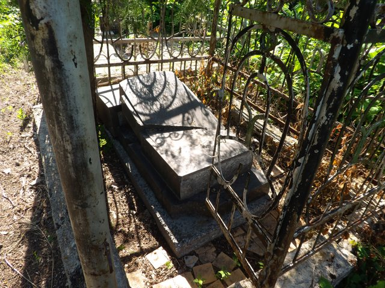](https://i.imgur.com/pI9dMTy.jpg)     
 Смертью у меня интересуется сестра, но и мне кое-что перепадает.   
   
 Армянское кладбище Ростова-на-Дону -- это типа как Новодевичье в Москве. Но в меньшем масштабе, разумеется. Всякие известные личности (ни одну из которых я не знаю) лежат там. Также там есть надгробия 19-го века. При входе стоит армянская церковь. Внутрь я не попал (но особо и не пытался). Рядом ошивался какой-то служитель кладбища, но я не стал у него спрашивать, можно ли попасть в церковь. А то начнутся расспросы, не армянин ли я (как это было со  [Змиёвской балкой](Ростов-на-Дону%20Змиёвская%20балка)  ).   
   
 Походил я по кладбищу всего полчаса... а потом у меня появилось подозрение, что на нём живёт что-то не то. Поэтому я не стал дальше его обследовать, хотя было что, а быстренько оттуда ушёл.   
   
 Фоточки отдельно:  [imgur.com/a/ANSglZx](https://imgur.com/a/ANSglZx)  .   
   
  [(фоточки)](https://zHz00.diary.ru/p218088575.htm?index=1#linkmore218088575m1)      [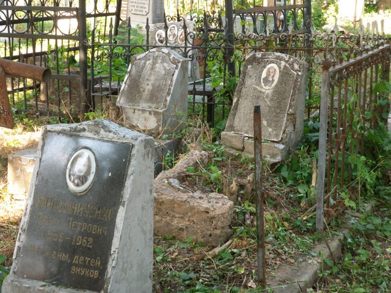](http://)    
 Вииидите, какие древние надгробия? А вот и нет. Это надгробия всего-навсего 60-х 70-х годов XX века. Просто они сделаны из бетона, а он крайне недолговечен. Крошится. Надгробия же XIX века смотрятся очень хорошо. В общем, хотите нормальное надгробие, выбирайте гранит, мрамор.   
   
  [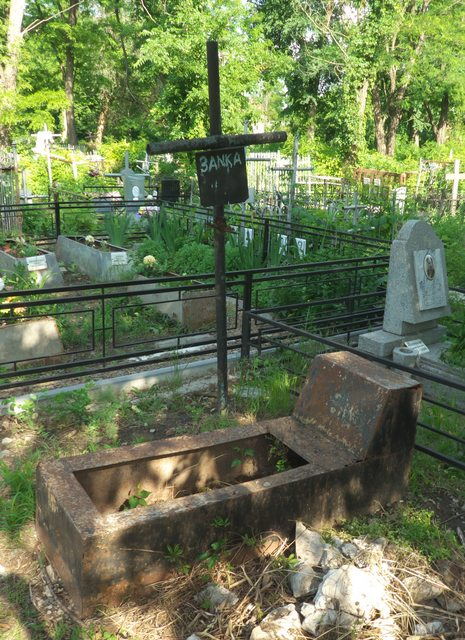](https://i.imgur.com/1YOMJsq.jpg)    
 БЕЗНОГNМ.   
   
  [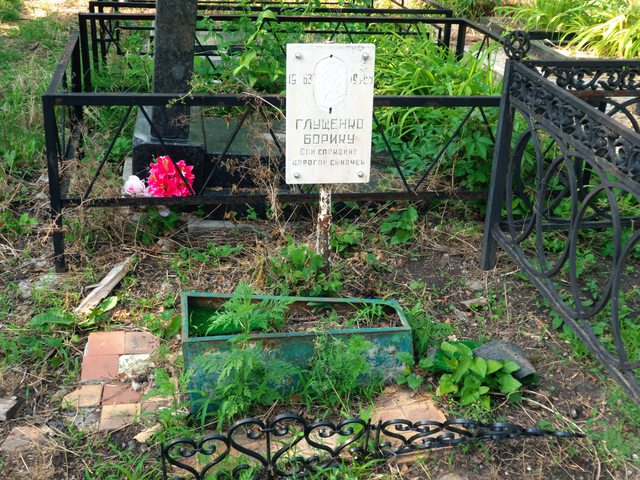](https://i.imgur.com/F6EaVY1.jpg)    
 Детские могилы особенно интересны. Что на них напишут? Борику было два годика.   
   
  [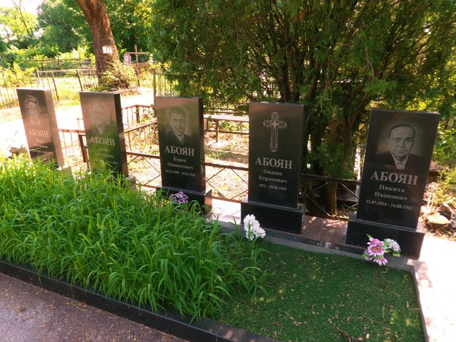](https://i.imgur.com/PKQzSbZ.jpg)    
 Много серийных могил. Некоторые смотрятся нормально, а некоторые, как эта -- забавно.   
   
  [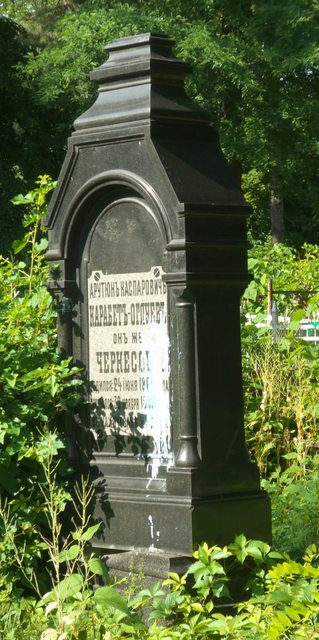](https://i.imgur.com/OhpOya7.jpg)    
 19-й век. Почему замазано краской? Скончался в Нахичеване-на-Дону. Это старое название района, где расположено кладбище.   
   
  [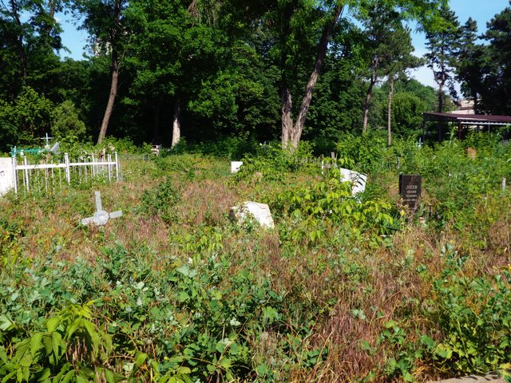](https://i.imgur.com/q8xwOXo.jpg)    
 Кладбище далеко не в порядке. По центральным аллеям всё более-менее, но есть места, где особо не убирают.   
   
  [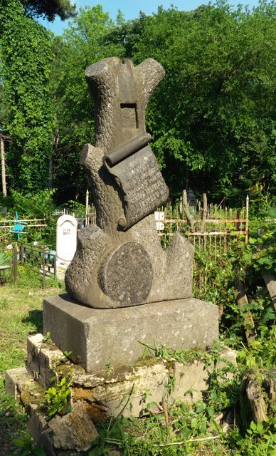](https://i.imgur.com/wqUDymF.jpg)    
 Ещё 19-й век. 1899. Армянские могилы часто имеют двойное именование -- по-армянски и по-русски. Три могилы нашёл в виде деревьев с обрубленными ветками. Спрашивал у знатоков, что это значит. Сказали, что либо это преждевременная смерть, либо прервавшийся род.   
   
  [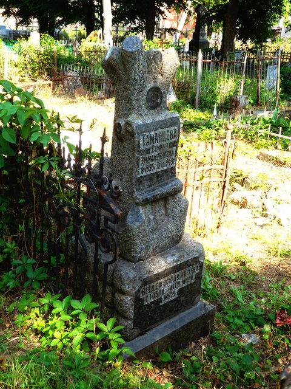](https://i.imgur.com/59MVByf.jpg)    
 Ещё одно дерево, но 1949 год.   
   
  [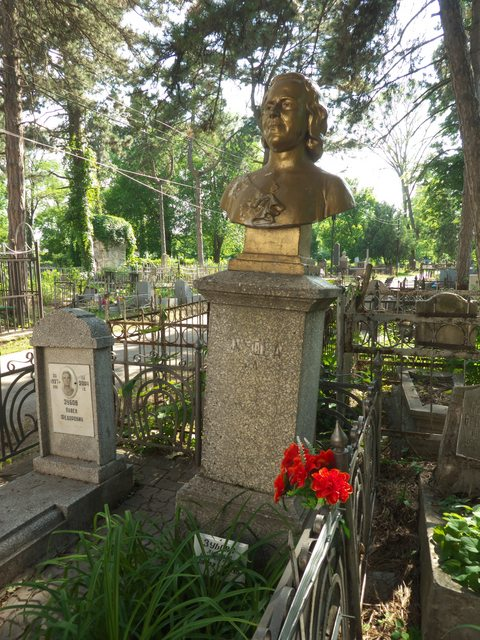](https://i.imgur.com/YMtErkw.jpg)    
 Чудовищно страшный бюст. Мне кажется, если бы он не был золотым -- было бы норм.   
   
  [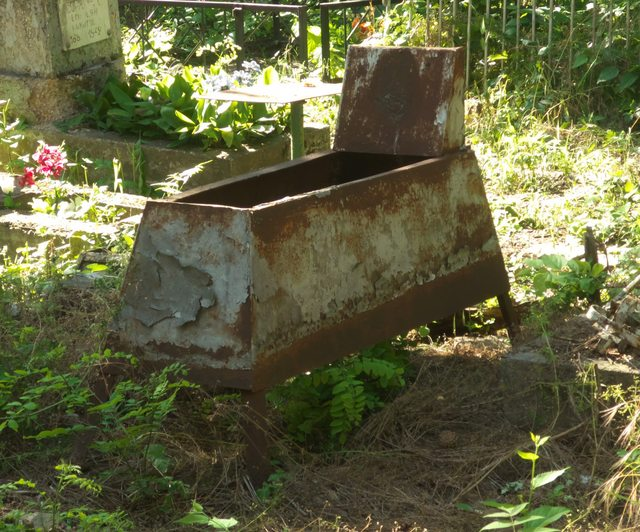](https://i.imgur.com/oKrDanE.jpg)    
 Тут видно, что типовое железное надгробие советских времён оказывается имеет ножки, которые втыкаются в землю.   
   
  [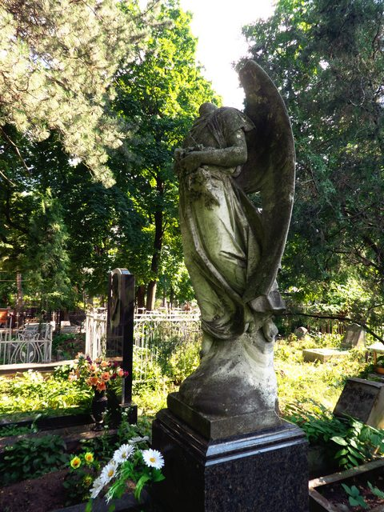](https://i.imgur.com/6RvZjqt.jpg)    
 Старее могил не нашёл. 1849.   
   
  [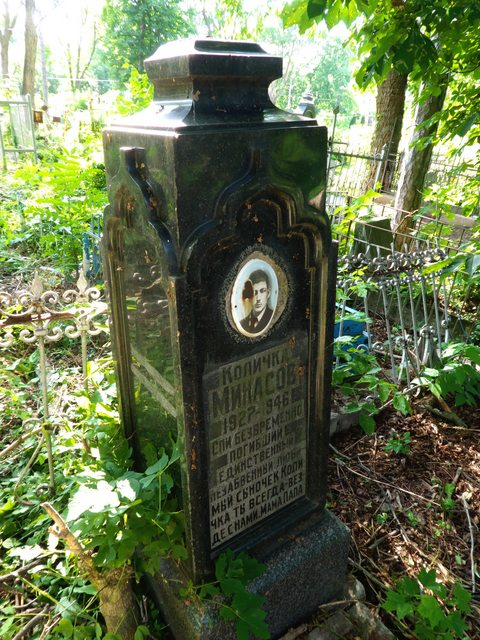](https://i.imgur.com/yaLKE5z.jpg)    
 Интересны переносы слов. А ещё... а что это такое вымарано на левой грани?   
   
  [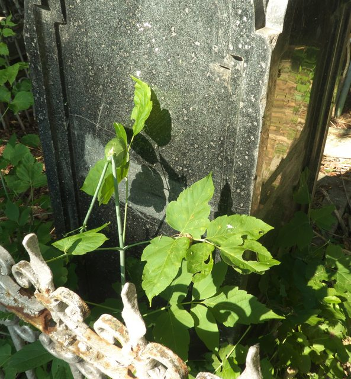](https://i.imgur.com/QyMDVCZ.jpg)    
 И сзади что-то вымарано!   
   
  [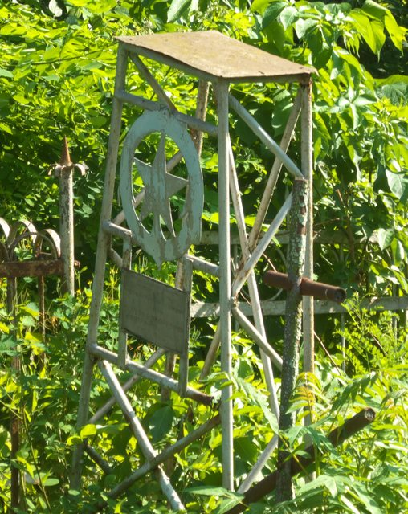](https://i.imgur.com/BBqaxIY.jpg)    
 У армянских могил редко присутствуют кресты, хотя армяне -- (древле)православные. А вот истинные коммунисты вместо креста хотят звезду.      
 <конец>   
    
 <https://diary.ru/~zHz00/p218088575_rostov-na-donu-armyanskoe-proletarskoe-kladbiwe.htm>   
   
 Теги:   
 [[Выставки]]   
 [[Случай из смерти]]   
 [[Ая]]   
 ID: p218088575