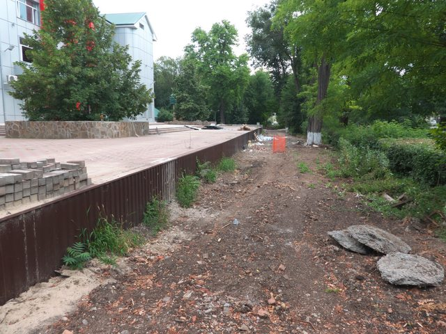

Ростов-на-Дону: Ростовская детская железная дорога
===================================================

   
 2019-08-03, 23:59   
         
   
 В общем, нет дороги! Разобрали. Якобы, на реконструкцию.   
   
 Дорога располагалась в Парке Островского. Парк мне не понравился. Со скамейками опять напряг. Туалетов не обнаружил.   
   
 Для справки: детская железная дорога это не дорога, по которой возят детей, а дорога, которой управляют дети.   
   
 Фотки отдельно:  [imgur.com/a/YUxrwik](https://imgur.com/a/YUxrwik)    
   
  [(фотки)](https://zHz00.diary.ru/p218098226.htm?index=1#linkmore218098226m1)       
      
 Дорога была однопутная, узкоколейная, неэлектрифицированная.   
   
      
 Дорога обходила парк по кругу. Станций было три: Победа (это она), Вити Черевичкина и Солнечная.   
   
      
 В здании Победы теперь работает кружок рисования.   
   
      
 Не думал, что окажусь в ситуации персонажей Tetsuko no Tabi, когда они стояли на платформе разобранной линии!   
   
      
   
      
 В середине парка обнаружены неприкаянные узкоколейные рельсы. Понятия не имею, для чего они использовались. Возможно, это была часть ДЖД?   
   
      
 Тут была стрелка, но она давно закатана, а асфальт растрескался. Теперь тут учебная площадка автошколы. При этом данное место проходит в стороне от основной линии ДЖД, которая есть на всех картах, и где велись работы. Ответвление налево уходит к месту, изображённому на предыдущем снимке и обрывается.   
   
      
 Вити Черевичкина. Витя Черевичкин был расстрелян немецкими оккупантами в 1941.   
   
      
 Надпись в стиле РЖД.   
   
      
 С другой стороны. Станция стоит уже давно, так что, видимо, ДЖД работала не используя закатанные в асфальт пути.   
   
      
 Больше всего признаки работ заметны на главной станции, Солнечной. Тут хоть какие-то стройматериалы и ограждения. Рядом с остальными станциями просто заровняли землю и смешали с песком.   
   
      
 А вот и оно, главное здание! У него была открыта дверь. Когда я начал наводиться на табличку при входе, я заметил, что изнутри к выходу двигается какой-то человек. Я не стал ждать, пока он выйдет из здания окончательно.   
   
      
 Часть подвижного состава находится в музее СКЖД. Один локомотив и два вагона. Состояние облупленное. Мне неизвестно, использовались ли эти вагоны на момент закрытия ДЖД или были списаны раньше.   
   
      
 Локомотив.   
   
      
 Облупленный вагон.   
   
      
 Внутри получше.   
      
   
 <Конец>   
    
 <https://diary.ru/~zHz00/p218098226_rostov-na-donu-rostovskaya-detskaya-zheleznaya-doroga.htm>   
   
 Теги:   
 [[Ая]]   
 [[Общественный транспорт]]   
 ID: p218098226