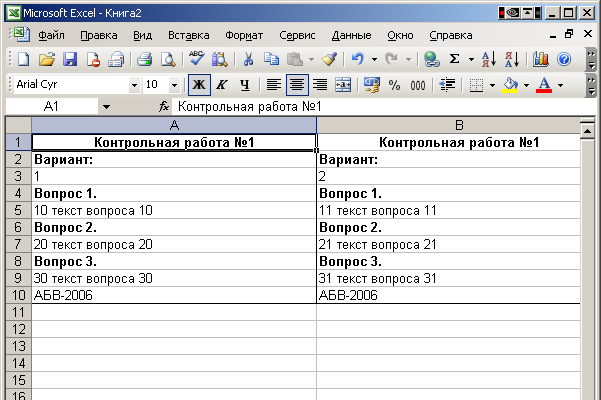
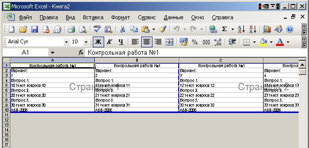
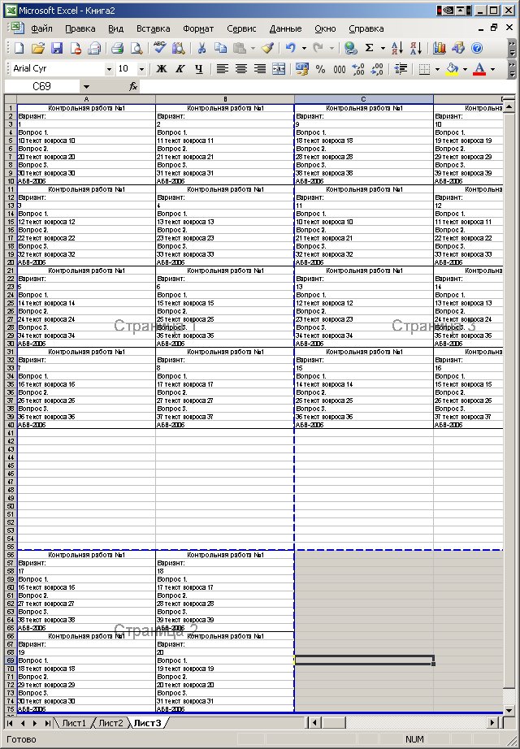

Составление вариантов контрольных работ в Microsoft Excel
==========================================================

   
 2013-11-28, 22:34   
   *Описана методика автоматизированной подготовки вариантов контрольных работ с применением Microsoft Excel. Для следования методике знание Microsoft Excel не требуется.*    
   
  [(читать дальше)](https://zHz00.diary.ru/p193425819.htm?index=1#linkmore193425819m1)      
 Для тех, кто ещё не в курсе, Excel -- это большой калькулятор. Я уже писал о том, как этим барометром забивать  [шурупы](TODO)  и  [гвозди](Программирование%20на%20Си%20с%20помощью%20Excel)  .   
   
 Но можно с ним делать не только это. Поговорим о студентах (школьниках). Задача: необходимо составить варианты контрольных работ. Основной подход, как правило, такой. Преподавателем создаётся 2 (4) уникальных варианта, которые всем раздаются. Разумеется, это упрощает проверку, но в итоге увеличивает шанс несамостоятельной работы (в т.ч. списывания). Даже если всех как-то там рассадить.   
   
 Гораздо лучше было бы, если бы число вариантов было большим -- десять, двадцать, сто. Но придумать такое большое число уникальных вариантов -- весьма трудоёмкое дело. В то время, как сделать варианты с частичным повторением заданий гораздо проще. В таких случаях при умеренном об'ёме работ, несамостоятельность учащихся будет ограничена (к примеру, только одним заданием). А владельцев остальных заданий своего варианта ещё надо найти.   
   
 Если придумать относительно короткий список заданий, а потом его перемешать, можно получить дохрена  *выглядящих по-разному*  частично совпадающих вариантов.   
   
 Ручное перемешивание и форматирование также весьма трудоёмко. И тут-то как раз нам поможет Microsoft Excel.   
   
 Итак, для примера рассмотрим создание контрольной работы из трёх заданий разного типа, при этом в каждом типе заданий будет один из десяти возможных вопросов. Итого: 30 уникальных вопросов (по 10 на тип задания, 3 типа). При традиционном подходе это даст 10 уникальных вариантов. Если воспользоваться частичными повторениями, можно будет настрогать до 1000 вариантов, в которых отличается хотя бы одно задание и до 100 вариантов, в которых отличается хотя бы два задания (подробное теоретическое решение данной задачи будет приведено позднее... наверное).   
   
 Итак, откроем Excel и на первом листе напишем в первой колонке в столбик все вопросы -- сначала все 1-го типа, потом 2-го типа, потом 3-го типа. Естественно, поскольку Excel поддерживает сложное форматирование в ячейках, туда можно вставлять любые картинки, математические формулы с интегралами (Microsoft Equation) и т.д. Вот так (тут первая цифра в номере вопроса обозначает номер задания):   
   
      
 Потом откроем второй лист. На нём у нас будет черновые версии вариантов, без форматирования. Основная задача состоит в том, чтобы превратить номера вопросов в их тексты. Напишем в столбик в первой колонке три каких-либо числа от 1 до 10, например, 3, 5, 7. Это будет значить, что первый вариант будем иметь в качестве 1-го задания 3-й вопрос 1-го типа, в качестве 2-го задания -- 5-й вопрос 2-го типа, а в качестве 3-го задания -- 7-й вопрос 3-го типа. Теперь надо заполнить таким же образом столько колонок. сколько вариантов вы хотите получить. Проще всего начать с "1, 1, 1", "2, 2, 2"... а когда числа закончатся, начать писать "1, 2, 3", "2, 3, 4" и т.д. Вообще, вопросы формирования вариантов выходят за рамки статьи. Описанная методика даст 20 разных вариантов (с максимум одним совпадающим вопросом), но всего их, как я уже говорил, 100.   
   
 Пропустим одну строку и напишем в ячейках ниже формулы в три строки:   
 =ДВССЫЛ(АДРЕС(ЯЧЕЙКА("содержимое";A1);1;1;ИСТИНА;"Лист1"))=ДВССЫЛ(АДРЕС(ЯЧЕЙКА("содержимое";A2)+10;1;1;ИСТИНА;"Лист1"))=ДВССЫЛ(АДРЕС(ЯЧЕЙКА("содержимое";A3)+20;1;1;ИСТИНА;"Лист1"))   
  *данные формулы указывают, что следует брать строки текста из первой колонки первого листа, причём в качестве номера строки надо брать номера из ячеек, расположенных выше по листу (A1, A2, A3); кроме того, иногда к номеру строки следует добавлять смещение; полученные строки следует размещать там, где введена формула*    
   
 Вместо 10 и 20 следует подставить число различных вопросов в задании. Если у вас только 6 вопросов, то надо писать +6 и +12. Если у вас 5 вопросов в варианте, то надо написать не 3 строки, а 5, и указать там дополнительно +30 и +40 (а также заменить в тех строках A3 на A4 и A5 соответственно). На самом деле, можно сделать общую формулу, но мне лень. Что-то типа +N\*X, где N -- число вопросов для каждого типа, а X -- скорректированный номер текущей строки (для этого есть готовая функция). Вместо "Лист1" следует указать настоящее имя первого листа. Если вы его не меняли, то ничего делать не надо.   
   
 Что такое формула в Microsoft Excel не рассказываю: это базовая концепция (точно так же, как копирование-перемещение ячеек -- базовый навык работы). Знать это важно, но для следования моей инструкции это необязательно.   
   
 После введения формул, выделите ячейки с ними и протяните за нижний правый угол выделение вправо до конца верхних столбиков:   
   
      
 Как видно, в нижних столбиках появились вопросы вариантов (я уменьшил ширину столбцов, чтобы было видно всё). Осталось сделать нормальное форматирование. Перейдём на третий лист.   
   
 Будем работать пока в первом столбике. В первой строке укажем название работы, например, "Контрольная работа №1". Во второй строке -- "Вариант:". В третьей: "1". В четвёртой -- "Вопрос 1.". В пятой -- формула:   
 =Лист2!A5   
 В следующих четырёх строках напишем чередуя "Вопрос 2", "Вопрос 3" и следующие формулы:   
 =Лист2!A6=Лист2!A7   
  *данные формулы указывают, что в текущую ячейку надо скопировать содержимое ячеек со второго листа, в которых были уже получены вопросы с 1-го листа (т.е. тех, где были вбиты прошлые формулы*    
   
 A5 -- ячейка с текстом первого вопроса первого варианта. Она расположена на втором листе. Первые три строки содержат только номера вопросов, потом строка пропуска (четвёртая), а вот с пятой начинаются тексты. Разумеется, если вопросов в варианте больше, надо по аналогии дописать следующие ячейки и начинать надо будет не с A5, а с другого числа (для 5 вопросов, например, надо начать с A7, а закончить A11)   
   
 В последней строке пишем сигнатуру автора -- в школе, где я учился, в качестве сигнатуры выступали инициалы учителя и год составления, например "АБВ-2006".   
   
 Поформатируем текст, например сделаем надпись "Контрольная работа №1" по центру, жирным, а "Вариант:" и "Вопрос..." -- просто жирными. Номер варианта сделаем по левому краю. Чтобы было видно, что всё работает, можно растянуть столбец по ширине, но этим займёмся позднее. Потом выделим все заполненные ячейки, выберем в контекстном меню "Формат ячеек...". На вкладке "Границы" нажмём "Внешние" и нажмём "ОК".   
   
 Выделим все заполненные ячейки и протянем за правый нижний угол вправо на 1 ячейку. Видите, вопросы изменились! И номер варианта тоже. Но постойте, изменился номер контрольной работы и год производства! (по крайней мере, в Excel 2003 и 2010) Непорядок! Меняем номер работы и год на старые правильные значения. Потом выделяем уже два столбца и тянем за правый нижний угол вбок на столько вариантов, сколько мы запланировали.   
   
 Варианты сформированы, осталось привести их в божеский вид. Выделяем все колонки, щелкаем правой кнопкой по заголовку, к примеру, первой и выбираем "Ширина столбца...". Если вы хотите иметь в печатном виде варианты шириной в половину A4, надо написать "40". Если в полный лист -- "80". Это довольно странно, но ширина столбца задаётся в числе условных знаков, которые должны вмещаться в ширину столбца. После этого меняем высоты строк с вариантами (при необходимости), чтобы вопросы целиком влезали в ячейки. Получается так:   
   
      
 В принципе, можно печатать, только так вы потратите на каждый вариант по листу бумаги (ну или по листу на 2 варианта, если ширина 40). Жалко. Хорошо было бы скомпоновать, чтобы на лист было по 4+ варианта, в зависимости от их размера.   
   
 Для этого есть средство! Нажимаем "Вид -- Разметка страницы" (для офиса 2003 -- в меню, для 2005 и выше -- на ленте). Видим такую картину:   
   
      
 Теперь берём мышкой и выделяем варианты 3 и 4. Перетаскиваем их прямо под варианты 1 и 2. Перетаскивать надо за нижнюю кромку выделения. Варианты 5 и 6 перетаскиваем под 3 и 4. Продолжаем процедуру, пока все варианты не окажутся на нужных местах. Вот что получилось в итоге (я умышленно перенёс третью страницу вниз, чтобы было видно всё сразу -- при этом она стала второй):   
   
      
 Тут я выбрал размещать по 8 вариантов на страницу (хотя, как видно, можно было по 10). При реальных заданиях, которые обычно более длинные, будет помещаться 4-6 вариантов. Замечу, что формулы при перетаскивании корректируются автоматом и продолжают отображать правильные значения.   
   
 Можно несколько упростить задачу, если начать с конца и сначала перетащить последние два варианта перед предпоследние два, а потом последние четыре (которые теперь уже на одной странице) под 6-й и 5-й с конца. Тогда не придётся продираться сквозь большое число пустых страниц при перетаскивании и утаскивать на всё большие расстояния.   
   
 Всё, можно печатать. Если когда-нибудь соберётесь проводить работу с таким же количеством вопросов и вариантов -- просто замените на первом листе вопросы и скорректируйте высоты строк на последнем листе.   
   
   
 Примечание для пользователей с английской версией Excel.   
 В английской версии всё по-английски, включая названия листов, пункты меню и даже формулы! Вообще, до этого надо было, конечно, додуматься -- в локализованных версиях переназывать все функции на национальные. Представьте себе, если бы в русской версии Визуальной Студии вам бы пришлось писать:   
 печатьф("%д", размер(цел));   
 Так или иначе, если с меню можно справиться без подсказки, то эквиваленты формул я всё же напишу:   
 АДРЕС -> ADRESS   
 ДВССЫЛ -> INDIRECT   
 ЯЧЕЙКА -> CELL   
   
 Кроме того, в форумлах следует заменить:   
 ИСТИНА -> TRUE   
 Лист1 -> Sheet1   
 Лист2 -> Sheet2   
 Лист3 -> Sheet3   
   
   
     
    
 <https://diary.ru/~zHz00/p193425819_sostavlenie-variantov-kontrolnyh-rabot-v-microsoft-excel.htm>   
   
 Теги:   
 [[Лайфхак]]   
 [[Студенты]]   
 [[Статьи]]   
 ID: p193425819