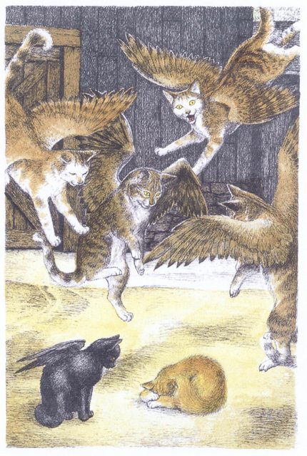

У. Ле Гуин, С.Д. Шиндлер // Цикл про крылатых кошек
====================================================

   
 2018-08-16, 23:59   
    
        
 Как же писать детскую литературу? Как надо для этого мыслить? Тут много нюансов, над которыми я пока не думал, поэтому писать про это не буду. Скажу только, что больших успехов на этом поприще достигли участники кружка ОБЭРИУ. Вот, например, А. Введенский:   
   
 
>  Дядя Боря говорит,   
>  Что   
>  От того он так сердит,   
>  Что   
>  Кто-то сбросил со стола   
>  Три тарелки, два котла   
>  И в кастрюлю с молоком   
>  Кинул клещи с молотком... 

   
 Ле Гуин кроме фантастики, оказывается, сочиняла ещё стишки ("silly poems", как она сама их назвала однажды) и вот -- детские книжки.   
   
 В серии четыре книжки. Они короткие -- около 50 страниц крупным шрифтом, при этом половину страниц занимают картинки.   
   
 Иллюстрации -- отдельная песня (пример см. выше). Без них произведения были бы неполными. Иллюстрации замечательные, к ним претензий никаких.   
   
 В серьёзных собраниях сочинений Ле Гуин данные рассказы не публиковались. И хорошо -- потому что их вряд ли бы издали вместе с картинками.   
   
 Первую книгу у нас выпустили в 2014, вторую в 2015. И затихли. Я опасался, что третья и четвёртая так и не выйдут, однако в этом году издательство "Карьера Пресс" таки их довыпустила.   
   
 О чём эти рассказы? О котах-мутантах. И убил их маркетинг. Вот какую франшизу можно было бы поднять -- ого-го! Черепахи-мутанты популярны. Пони-мутанты -- популярны. А котам не повезло.   
   
 Все четыре рассказа об'единены общими персонажами. При этом приключения, в которые они попадают -- довольно серьёзные. Не всё тут мир-дружба-жвачка. Полагаю, что подходящий возраст для чтения -- 6-7 лет.   
   
 Последовательность чтения важна. Нельзя сказать, что есть слитный сюжет, однако мир сохраняет свой статус между рассказами, а внутри рассказов статус изменяет.   
   
 Первые два рассказа -- "Крылатые кошки" и "Крылатые кошки возвращаются" -- очень хорошие.   
   
 Вот третий -- "Удивительный Александр и крылатые кошки" -- отстой. Начало хорошее, но в конце сначала жуткий сеанс кошачьей психотерапии, а потом вообще что-то вроде морализаторства. Да, Александр это тоже кот.   
   
 "Джейн сама по себе": неплохо, но до уровня первых двух не дотягивает.   
   
 Настоящий недостаток данной серии -- плохой перевод (или редактура). Почти весь текст выглядит прилично, но то тут то там выскакивают недочёты. Взгляните на два предложения (из разных мест):   
   
 
>  Если спускаться [с дерева], то стоит поставить неверно хоть одну лапу, есть риск упасть с огромной высоты.   
>    
>  Она знала, что если люди в городе нас поймают, то превратят нашу жизнь в сплошное шоу, посадят нас в клетки, и мы никогда не увидим свободы. 

   
   
 Пёс его знает, рекомендовать ли детям эту штуку. Из взрослых рекомендую любителям кошек и любителям Ле Гуин.   
    
 <https://diary.ru/~zHz00/p216045761_u-le-guin-s-d-shindler-cikl-pro-krylatyh-koshek.htm>   
   
 Теги:   
 [[Книги]]   
 ID: p216045761