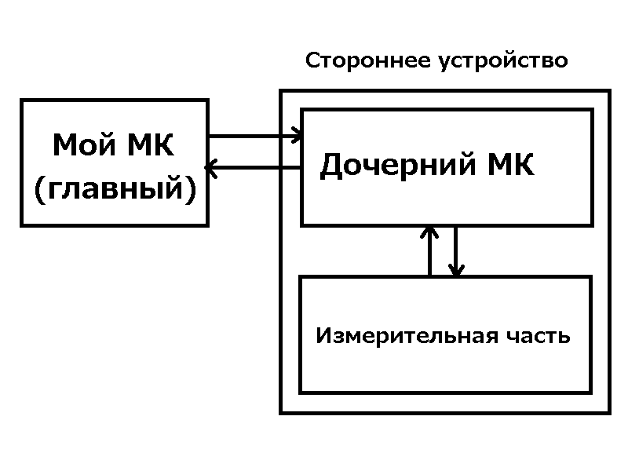

Я бы попросил помощи у Доктора Хауса
=====================================

   
 2022-11-29, 00:04   
  Не знаю, как бы описать покороче и поинтереснее. Поэтому будет подлиннее и поскучнее.   
   
        
 Очень долго не мог настроить железку. Даже с помощью разработчика. Потому что у него всё работало, а у меня нет.   
   
  [(стена текста)](https://zHz00.diary.ru/p221415064.htm?index=1#linkmore221415064m1)      
   
  **Итерация 1.**    
   
 Было две модификации железки, А и Б. По интерфейсу должны были быть идентичными. Модификация А существовала в единственном экземпляре и мне с ней работать было вообще не надо. Но мне по ошибке выдали её. Я всё для неё сделал и всё заработало. И тут бы и сказочке конец, но начальник внезапно обнаружил ошибку и сказал -- вот тебе модификация Б.   
   
 Модификация Б не работала. Не было ответа. На модификации А были полезные светодиоды, которые показывали, что железка работает. На модификации Б такого не было.   
   
 Причина могла быть любой -- неправильно заданный адрес, неправильная скорость передачи (RS-485), полная нерабочесть платы и т.д. Я проверил ещё два экземпляра, но ни один не отвечал.   
   
 Тогда я передал устройства разработчику. Он их подключил у себя, и у него всё заработало. Устройства были возвращены нам.   
   
 В качестве эксперимента я решил подключить железку не через главный микроконтроллер (МК), а через компьютер. У меня был конвертер USBRS485, спаял переходник и всё заработало. Это был важный момент, поскольку теперь было известно, что устройство работает. Также я знал скорость и адрес. Но мне надо было, чтобы оно передавало данные в МК.   
   
  **Итерация 2.**    
   
 Узнав о том, что устройство отвечает компу, но не отвечает МК, разработчик стал думать, но ничего не придумал. Поэтому он лично явился ко мне с логическим анализатором под мышкой.   
   
 Мы подключили устройство к микроконтроллеру и стали смотреть данные. Состав пакета был правильный, однако при передаче с компьютера байты передавались подряд, а при передаче с МК пауза между байтами составляла 3-4 байта.   
   
 ОКАЗАЛОСЬ, что разработчик поставил в прошивке таймаут (которого видимо не было в модификации А), так что если промежуток между байтами превышает полтора байта -- приём пакета начинался заново.   
   
 Это очень ценная функция. Если её не сделать, то при ошибках передачи устройство никогда не сможет восстановить синхронизацию по началу пакета. Об этом я уже  [писал](Подводные%20камни%20при%20определении%20границ%20сообщений)  . Однако в текущей ситуации это обернулось против нас.   
   
 Разработчик прошил таймаут равный 15 байтам и отдал устройство мне. Оно заработало. Я поставил его на постоянный автоматический опрос и ушёл на выходные.   
   
  **Итерация 3.**    
   
 Придя на работу, я проверил, что за всё время не было ни единого разрыва, ни единой ошибки передачи. Устройство было измерительное, поэтому я провёл им парочку измерений и оно показало какие-то числа (не нули). Метрология на текущем этапе меня не волновала.   
   
 Я взял устройство и отнёс нашему сборщику, сказав, что можно монтировать в корпус.   
   
 Через час он вернул мне устройство, я его подключил и обнаружил, что устройство больше не работает. Но не так, как раньше. Оно выдавало ответы, но ответы содержали в себе нули, что бы я ни пытался померить. Дааа, конееечно, "после" не значит "вследствие". Но что получалось? В 08-30 у меня всё работало. После этого я отнёс устройство сборщику. В 09-30 устройство работать перестало. Вывод?   
   
 То, что устройство отвечало (я проверил по осциллографу, что ответ есть) было очень хорошо, т.к. означало что работает дочерний микроконтроллер. Но к нему была подключена измерительная часть (см. блок-схему ниже). И вот складывалось впечатление, что перестала работать именно она. Но почему?   
   
        
 Потому что сборщик случайно изменил электронную схему устройства. Других вариантов я придумать не мог. Я пошёл к сборщику, он стал смотреть на плату в микроскоп. Пропаял парочку подозрительных мест. Это не помогло.   
   
 Мы взяли второе устройство и попробовали с ним. Оно тоже не работало. Да, важно отметить, что результат был одинаковый и при подключении к МК, и к компьютеру: ответ есть, но приходят нули.   
   
 Всего устройств у нас было три. Я решил, что если два мы уже испортили по неизвестной причине, то третье трогать не надо.   
   
 Мы снова передали устройства разработчику, чтобы он нам починил то, что мы сломали.   
   
 Однако. У разработчика всё работало!   
   
  **Итерация 4.**    
   
 Моя конспирологическая теория о том, что сборщик изменил схему, пока собирал устройство, не оправдалась. А это значило, что пришло время для ещё более тяжёлых конспирологических теорий. Итак, что мы имеем на входе?   
   
 1. Устройство работало в 08-30, а в 09-30 перестало.   
 2. Дочерний микроконтроллер в норме, проблемы с измерительной частью.   
 3. Устройство не работает именно у меня на рабочем месте. Ни через компьютер, ни через МК.   
 4. У разработчика дома устройство работает.   
   
 Какие выводы можно сделать? Что-то не так либо со мной, либо с рабочим местом. И это "не так" стало в промежутке между 08-30 и 09-30, что совпало по времени с тем, что сборщик собирал устройство в корпус. Странно, не правда ли?   
   
 Тогда я придумал вот что. Попробовать запустить устройство на другом компьютере с другим экземпляром главного МК. Блоков с главным МК у нас несколько, компьютеров тоже.   
   
 Я собрал макет в другой комнате, всё туда поставил, подключил. И... всё заработало.   
   
  **Итерация 5.**    
   
 К предыдущим четырём пунктам добавился ещё один.   
 5. Устройство работает в соседней комнате.   
   
 Оставалось две вещи: плохое заземление и электромагнитные помехи (которые возникли в промежуток с 08-30 до 09-30 и с тех пор не прекращались). По-прежнему всё было очень странно.   
   
 Я взял кабель подлиннее, стал носить устройство вокруг своего рабочего места. Но толку не было.   
   
 Начальник: Ну что, как успехи?   
 Я: Я ставлю эксперименты прямо у вас на глазах.   
 Начальник: Э, у меня на глазах не надо!   
 Я: Окей. Я...  *занимаюсь наукой.*    
   
 Я позвонил разработчику, рассказал всё как есть. Он сказал -- слушай, наверное у тебя питания не достаёт!   
   
 Я стал мерить питание. И ОКАЗАЛОСЬ, что вместо 5 вольт мой МК выдаёт только 4.6 вольта.   
   
 ДА, измерительный блок в устройстве работает в настолько узком диапазоне напряжений, что 4.6 ему уже мало (при номинальном 5.0).   
   
 Оставалась последняя загадка. Почему у меня блок в 08-30 выдавал 5 вольт, и всё работало, а в 09-30 стал выдавать 4.6?   
   
  **Итерация 6.**    
   
 Дело было в человеческом факторе. У главного МК есть несколько раз'ёмов идентичной функциональности. Каждый из них должен выдавать 5 вольт. Когда я проводил первичное тестирование, я всегда подключал устройство к первому раз'ёму. Когда же мне принесли собранное устройство, то на первый раз'ём пошёл другой кабель, который был нужен для других целей, и который входил в комплект устройства. А само устройство я подключил через второй.   
   
 И только на втором напряжение было 4.6 вольта. Остальные выдавали 5.1 вольта, что было нормальным.   
   
 Почему же именно этот один раз'ём выдавал такое низкое напряжение? Доподлинно это неизвестно, но почти наверняка причина была в том, что я некоторое время назад по неосторожности замкнул 5 вольт этого раз'ёма на 24 вольта из другого места. Да, там на выходе стояла микросхема с защитой, и защита сработала. Но защита хорошо работает только в случае короткого замыкания на землю. Предотвращать подключение к слишком высоким напряжениям она тоже может, но микросхема после этого деградировала и стала выдавать 4.6 вместо 5.   
   
 В итоге я поменял кабели местами. Первому кабелю было всё равно, 5 вольт там или 4.6, поэтому первый кабель пошёл на 2-й раз'ём. А второй кабель на первый, где напряжение было нормальное.     
    
 <https://diary.ru/~zHz00/p221415064_ya-by-poprosil-pomowi-u-doktora-hausa.htm>   
   
 Теги:   
 [[Фейлы]]   
 [[Борьба с техникой]]   
 ID: p221415064